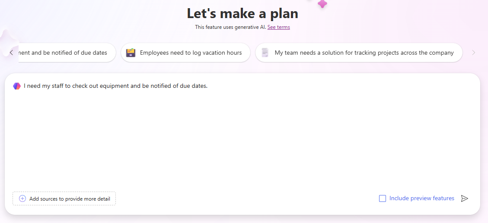

---
lab:
  title: 'Lab 1 : Membuat solusi dengan Perancang Rencana'
  learning path: 'Learning Path: Describe the business value of Microsoft Power Platform'
  module: 'Module 2: Describe the business value of extending business solutions by using Microsoft Power Platform'
---

## Tujuan pembelajaran

Dalam latihan ini, pelajar akan menggunakan perancang Paket untuk membangun solusi bisnis lengkap yang ditargetkan yang dapat mencakup aplikasi, alur kerja, agen, dan banyak lagi. Copilot akan memandu Anda melalui seluruh proses pembuatan solusi.

Setelah berhasil menyelesaikan lab ini, Anda akan:

- Gunakan perancang Paket untuk membangun solusi.
- Gunakan Agen data untuk membangun model data.
- Gunakan agen Solusi untuk menghasilkan berbagai komponen yang diperlukan.

### Skenario

Contoso Consulting adalah organisasi layanan profesional yang berspesialisasi dalam layanan konsultasi IT dan AI. Karena mereka telah beralih ke model hybrid-work, banyak karyawan Contoso bekerja dari rumah. Hal ini menyebabkan tantangan karena karyawan mereka sering kali perlu memeriksa peralatan.

Contoso ingin menggunakan Power Platform untuk membangun solusi untuk mengelola check in dan out peralatan.

Dalam latihan ini Anda akan menggunakan perancang Paket di Microsoft Power Platform untuk memberikan deskripsi tantangan bisnis yang coba Anda selesaikan, dan menggunakan rekomendasi untuk membuat solusi

> [!IMPORTANT]
> Lab ini menggunakan AI untuk membangun komponen. Karena hasil AI dapat bervariasi, penting untuk dicatat bahwa hasil Anda mungkin berbeda (tetapi mirip) dengan apa yang didefinisikan di lab. Konsep dasar yang diuraikan dalam lab akan sama tidak peduli apa yang dibuat atau apa namanya. Jika objek yang disarankan/dibuat tidak cocok dengan apa yang tercantum dalam instruksi dengan tepat, Anda mungkin perlu membuat Penyesuaian berdasarkan apa yang dibuat untuk Anda.*

### Waktu Lab

Perkiraan waktu untuk menyelesaikan latihan ini adalah **20 hingga 30** menit.

## Tugas 1: Gunakan Perancang Paket untuk membuat rencana solusi

**Menggunakan Perancang Paket**

1. [Buka portal pembuat](https://make.powerapps.com) Power Apps dan navigasikan ke **layar Beranda**.
2. Di bawah **Mari buat rencana**, masukkan teks berikut: "*Saya perlu staf saya untuk memeriksa peralatan dan diberi tahu tentang tanggal jatuh tempo.*"

3. Pilih tombol **Buka**.
4. Perancang Paket akan menghasilkan paket berdasarkan deskripsi yang Anda berikan. Paket ini akan mencakup hal-hal berikut:
    - Masalah Bisnis
    - Tujuan rencana ini
    - Persyaratan pengguna

Agen **** Persyaratan membangun persyaratan pengguna berdasarkan deskripsi yang Anda berikan dan harus dianggap sebagai titik awal untuk paket Anda. Anda dapat mengubah persyaratan sesuai kebutuhan.

5. Untuk mengubah persyaratan, pilih tombol **Edit** .
6. **Di bidang Copilot** di bawah **judul Persyaratan** pengguna, masukkan: "*Staf harus dapat melaporkan jika ada masalah dengan peralatan saat mereka memeriksanya*."
7. Pilih tombol **Buka**.

Persyaratan pelaporan masalah baru akan ditambahkan ke paket Anda.

8. Setelah Anda puas dengan persyaratan saat tercantum, pilih tombol **Pertahankan** .
9. Jika Anda puas dengan persyaratan yang dihasilkan oleh **agen** Persyaratan, pilih **Terlihat bagus**.

Selanjutnya, **agen** Model data membantu Anda dalam membuat model data Anda. Ini akan membuat saran tentang tabel apa yang harus dibuat untuk menyimpan data untuk solusi Anda.

10.  Untuk melihat detail model, pilih **Perlihatkan Detail**.

Semua tabel, kolom, dan hubungan yang disarankan akan ditampilkan di perancang model data. Anda bisa menggunakan panel Copilot untuk membuat perubahan pada model data.

11.  Di panel **Salinan** di sisi kanan layar, masukkan yang berikut ini: "*Tambahkan kolom teks ke tabel Peralatan yang disebut Nomor item.*"
12.  Setelah kolom ditambahkan ke **tabel Peralatan** , gunakan **Copilot** untuk memasukkan perintah berikut satu per satu:
    - "Tambahkan kolom teks baru ke tabel Staf/Karyawan yang disebut Manajer."
    - "Tambahkan kolom pilihan baru ke tabel Peralatan yang disebut Jenis Peralatan."
    - "Tambahkan kolom pilihan baru ke tabel Peralatan yang disebut Jenis Peralatan. “

Model data Anda akan terlihat seperti yang tercantum.

> [!NOTE]
> > Kemungkinan tidak akan sama persis. Dan itu baik-baik saja.

13.  Menggunakan navigasi di sebelah kiri, pilih **ikon Gambaran Umum** . *(Terletak di bawah Panah Belakang.)*
14.  **Di Agen** Data, pilih **Terlihat bagus** untuk melanjutkan ke langkah berikutnya.

**Selanjutnya Agen** Solusi akan memberikan saran untuk item yang berbeda. Dalam kasus kami, disarankan agar agen membuat dua aplikasi Canvas, alur Power Automate, dan Agen. *(Anda mungkin berbeda)*

15.  **Di Agen** Solusi, pilih tombol **Edit**.
16.  **Di bidang Copilot**, di bawah judul Teknologi, masukkan yang berikut ini: *"Buat agen pembayaran item untuk menjawab pertanyaan karyawan."*
17.  Pilih tombol **Buka**.
18.  **Agen** Checkout Item akan ditambahkan. Pilih **Pertahankan**.
19.  Jika Anda senang dengan saran dari **Agen** Solusi, pilih **Terlihat bagus**.
20.  Pilih **Simpan Tabel buat model data yang disarankan** .

Perancang paket membangun file solusi untuk semua paket yang Anda buat. Solusi adalah komponen penting dari Manajemen Siklus Hidup Aplikasi (ALM).

21.  **Pada layar Di mana Anda ingin menyimpan thigs**, atur Nama solusi ke Sistem Pemeriksaan Peralatan dan pilih tombol **Simpan**.

Diperlukan waktu antara 1 hingga 3 menit agar semua item yang disarankan oleh perancang Paket dibuat. Setelah pesan yang menunjukkan tabel Anda disimpan, pilih **X** untuk menutup pesan tampilan.

## Tugas 2: Membuat dan memodifikasi aplikasi solusi paket Anda

Sekarang perancang rencana telah membuat semua tabel yang diperlukan, dan memberikan saran bagi objek untuk dibuat, kita akan membangun apa yang disarankan. Kita akan mulai dengan membangun Aplikasi Checkout Peralatan.

1.  Pastikan Anda membuka **paket Sistem** Checkout Peralatan.
2.  Di panel **Gambaran Umum** Paket masih ditampilkan, pilih tombol ciutkan untuk memberi Anda ruang desain mode. *(Terletak di kanan atas panel gambaran umum.)*
3.  Di jendela **Desain** , temukan **Aplikasi** Checkout Peralatan dan pilih tombol **Buat** . *(Power Apps akan dengan cepat membangun aplikasi.)*

Setelah aplikasi Anda dibuat, kami akan membuat beberapa modifikasi dasar untuk itu. Sebelum kita melakukan itu, mari kita lihat di sekitar aplikasi.

4.  **Pilih layar** Selamat Datang. *(Menyediakan akses cepat ke item seperti reservasi, checkout, dan ekstensi.)*
5.  Pilih **layar Reserve entities / Checkouts** . *(Memungkinkan Anda membuat baru, melihat, mengedit, dan menghapus reservasi / checkout.)*
6.  Navigasikan ke layar tambahan seperti **Permintaan ekstensi dan **Pemberitahuan** *(Atau layar mana pun yang kami buat untuk aplikasi Anda)***.
7.  **Pilih layar Selamat Datang.**
8.  Pilih gambar di atas **Reserve entities / checkouts.**
9.  Dari menu yang muncul, pilih **Edit **** \> Gambar Stok.**
10.  Di kotak **Pencarian** masukkan **Peralatan**.
11.  Pilih salah satu gambar yang disarankan dari daftar dan pilih tombol **Sisipkan** . *(***OPSIONAL:** *Ulangi sesuai keinginan untuk gambar yang tersisa)*
12.  Pilih deskripsi** di **bawah teks Reserve entities / checkouts.
13. Pada bilah **Perintah**, pilih tombol **Properti** . *(Terletak tepat di sebelah kanan tombol Pengeditan.)*
14. **Ubah properti Teks** menjadi: "Mulai baru atau lihat reservasi yang sudah ada."
15. **Pilih teks Reserve entities / Checkouts**,
16. Ubah properti Teks menjadi "Peralatan Cadangan."
17. **Pilih teks layar** Selamat Datang di bagian atas layar.
18. **Ubah properti Teks** menjadi "Checkout Peralatan Contoso."
19. Di panel **Properti** , di bawah **Gaya dan tema**, ubah warna isian menjadi **Biru** Tua. Pilih gambar di atas **Staf**.

Layar** Selamat Datang aplikasi **Anda akan menyerupai gambar yang ditampilkan:

Perubahan tambahan dapat dilakukan sesuai keinginan Anda, tetapi untuk saat ini kami akan menguji aplikasi.

20.  Pada bilah perintah, pilih **ikon Putar** . (*Perhatikan tata letak aplikasi akan berubah berdasarkan ukuran* layar Anda)
21.  Pilih **gambar Peralatan** Cadangan.
22.  Untuk mengedit rekaman, pilih tombol **Edit** .
23.  Ubah **Nama** rekaman.
24.  **Pilih ikon Tanda** centang untuk menyimpan perubahan Anda.
25.  Pilih tombol **Beranda** untuk kembali ke **Layar** Selamat Datang.
26.  Di sudut kanan atas aplikasi, pilih **Purple X** untuk kembali ke perancang.
27.  Pada bilah **Perintah**, pilih **ikon Simpan** untuk menyimpan aplikasi Anda.
28.  Tutup tab Browser** Anda **untuk kembali ke **Perencana** Desain. (*Perhatikan tombol di bawah aplikasi Anda telah berubah dari buat menjadi edit.*)

> [[!NOTE]
> Jika Anda ingin mengulangi langkah-langkah di atas, Anda juga dapat membuat dan memodifikasi aplikasi Manajemen Peralatan.

## Tugas 3: Membuat alur yang disarankan

Selain aplikasi yang disarankan oleh perancang Paket, kemungkinan ada alur pemberitahuan pengingat yang disarankan juga. Selanjutnya, kita akan membuat alur yang disarankan.

1.  Di jendela **Desain** , temukan **alur** Pemberitahuan Pengingat dan pilih tombol **Buat** . *(perancang alur Power Automate akan terbuka)*
2.  Anda akan diberikan alur yang **Disarankan, pilih **Simpan dan lanjutkan****.
3.  **Pada layar Tinjau aplikasi dan layanan** yang terhubung, verifikasi bahwa semua koneksi memiliki tanda centang hijau, dan pilih tombol **Buat Alur**.

Alur yang dibuat adalah alur berulang yang akan berjalan setiap hari, Identifikasi dan checkout jatuh tempo hari ini, dan untuk masing-masing orang mengirim email ke individu yang memeriksa item.

4.  Pilih pemicu **Pengulangan** .
5.  Perhatikan bahwa pemicu telah secara otomatis dikonfigurasi ke **Interval **** 1** dan **Frekuensi** Hari. *(Anda juga dapat menentukan waktu tertentu dalam sehari.)*

6.  **Pilih langkah Daftar baris**.

Langkah ini akan melihat **tabel Pemberitahuan** yang dibuat sebagai bagian dari model data kami dan mengidentifikasi rekaman apa pun dengan **DueDate** of **Today**.

7.  Jika ada nilai di **bidang Nama** Tabel, hapus nilai tersebut.
8.  **Di bidang Nama** tabel, ketik **Pemberitahuan**, dan pilih **Pemberitahuan [cX\#X\#_notifications]** atau item bernama serupa di lingkungan Anda.

9.  **Pilih langkah Untuk Setiap**.
10.  Untuk setiap rekaman yang diidentifikasi dalam **langkah Baris** Daftar, alur akan mengirim email ke alamat email karyawan yang memiliki item yang dicek keluar untuk mengingatkan mereka bahwa item mereka jatuh tempo kembali hari ini.

    
> [!IMPORTANT]
> Pastikan langkah email Anda memiliki data di dalamnya. Kegagalan untuk menyertakan data akan mengakibatkan kesalahan. JIKA data hilang, isi bidang langkah untuk mencocokkan gambar di atas. Anda bisa memasukkan alamat email Anda sendiri di bidang Kepada jika Anda mau.

Anda dapat membuat perubahan tambahan yang sesuai dengan alur. Untuk saat ini, kita akan membiarkannya apa adanya.

11.  Pada bilah **Perintah**, pilih tombol **Simpan Draf** .
12.  Klik tombol **Terbitkan**.
13.  Tutup tab **Browser** untuk kembali ke **tab Desainer** paket.
14.  **Perhatikan Bahwa Alur** Pemberitahuan Pengingat sekarang memiliki **ikon Edit** di sampingnya.

## Tugas 4: Membuat Agen Checkout Item

Terakhir, perancang Paket memberikan saran untuk agen Checkout Item yang dapat dimanfaatkan pengguna untuk menjawab pertanyaan mereka tentang reservasi dan banyak lagi.

1.  Di jendela **Desain** , temukan **Agen** Checkout Item dan pilih tombol **Buat** . *(Copilot Studio akan terbuka)*

    Studio copilot akan menambahkan pengetahuan ke agen berdasarkan tabel dalam solusi Anda. Pengetahuan tambahan dapat ditambahkan sesuai kebutuhan. Untuk hari ini, kita akan meninggalkan Agen apa adanya.

2.  Di panel **Uji agen** Anda, masukkan yang berikut ini: *"Apakah Bob Johnson memiliki item yang terlambat dicek keluar?"*
3.  Agen akan mengembalikan respons berdasarkan data dalam tabel Anda.

4.  Di **Copilot Studio**, pilih tombol **Terbitkan** .
5.  **Pada layar Terbitkan agen** ini, pilih tombol **Terbitkan**.
6.  Tutup tab **Browser** , untuk kembali ke **Perancang** paket.

## Tugas 5: Simpan Paket Anda

1.  Di Paket Anda, pilih tombol **Simpan** untuk menyimpannya.
2.  Setelah penyimpanan selesai, pilih tombol Panah kembali **untuk kembali ke **portal pembuat Power Apps**.**
3.  Menggunakan navigasi di sebelah kiri, pilih **Paket**.
4.  Perhatikan paket Sistem** Checkout Peralatan Anda **sekarang tercantum.
5.  Pilih **paket Sistem** Checkout Peralatan untuk membuka paket yang dicadangkan di editor.
