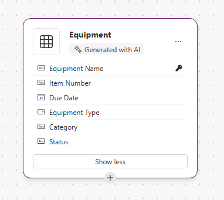

---
lab:
  title: 'Lab 2: Membuat model data'
  learning path: 'Learning Path: Manage the Microsoft Power Platform environment'
  module: 'Module 1: Describe Microsoft Dataverse'
---

## Tujuan pembelajaran

Dalam latihan ini, pelajar akan menggunakan Copilot untuk membangun model data. Anda akan memberikan deskripsi jenis tabel yang ingin Anda buat dan gunakan perancang untuk membuat perubahan sesuai kebutuhan seperti menambahkan kolom tambahan.

Setelah berhasil menyelesaikan lab ini, Anda akan:

- Gunakan Copilot untuk membantu Anda membuat model data.
- Tambahkan dan edit kolom ke tabel.

### Skenario

Contoso Consulting adalah organisasi layanan profesional yang berspesialisasi dalam layanan konsultasi IT dan AI. Sepanjang tahun, mereka menawarkan banyak acara yang berbeda kepada pelanggan mereka. Beberapa di antaranya adalah acara gaya pameran dagang di mana mereka memiliki banyak mitra masuk dan memberikan detail tentang produk baru, tren pasar, dan layanan. Yang lain terjadi sepanjang tahun dan merupakan webinar cepat yang digunakan untuk memberikan detail tentang masing-masing produk.

Contoso ingin menggunakan Power Platform untuk membangun solusi Manajemen peristiwa yang dapat mereka gunakan untuk mengelola berbagai peristiwa yang mereka host sepanjang tahun. Selain itu, Contoso ingin membangun beberapa aplikasi untuk mendukung program Employee Equipment Check Out mereka. 

Dalam latihan ini Anda akan membuat mode data yang akan digunakan untuk menyimpan berbagai jenis peristiwa, pendaftaran peristiwa, dan data lain yang diperlukan contoso untuk mengelola peristiwa mereka secara efektif. Anda juga akan membuat tabel Peralatan yang akan digunakan dalam aplikasi mereka yang lain.  

### Detail Lab

Sebelum memulai latihan ini, disarankan untuk menyelesaikan:

- **Lab 1 – Membuat solusi**

> **Penting:** Lab ini menggunakan AI untuk membangun komponen. Karena hasil AI dapat bervariasi, penting untuk dicatat bahwa hasil Anda mungkin berbeda (tetapi mirip) dengan apa yang didefinisikan di lab. Konsep dasar yang diuraikan dalam lab akan sama tidak peduli apa yang dibuat atau apa namanya. Jika tabel dan kolom tidak sama persis, Anda mungkin perlu menyesuaikan dengan apa yang dibuat untuk Anda.

### Waktu Lab

Perkiraan waktu untuk menyelesaikan latihan ini adalah **30 hingga 45** menit.

> **Catatan:** Di lab sebelumnya, kami membuat solusi Manajemen peristiwa dan menetapkannya sebagai solusi pilihan di lingkungan ini. Untuk alasan itu, kita tidak perlu langsung masuk ke solusi untuk membuat model data kita. Item yang kita buat akan secara otomatis ditambahkan ke solusi.

## Tugas 1: Membuat model data

Contoso saat ini menyimpan informasi kontak donor dalam instans Dataverse mereka. Mereka ingin menggunakan Dataverse untuk melacak hibah yang mereka ajukan dan sumbangan yang mereka terima. Anda perlu membuat tabel yang diperlukan untuk mendukung kebutuhan aplikasi Contoso di masa mendatang.

1.  Jika perlu, buka browser web dan navigasikan ke [portal pembuat Power Apps](https://make.powerapps.com/) , dan Masuk menggunakan kredensial akun Microsoft Anda.
1.  Saat berada di layar beranda Power Pages, menggunakan navigasi di sebelah kiri, pilih **Tabel**.
1.  Di bawah **Tabel**, pilih **Mulai menggunakan Copilot**.
1.  **Di layar Jelaskan tabel yang ingin Anda buat salinannya**, masukkan: "*Buat tabel untuk mengelola peristiwa. Tabel harus mengidentifikasi nama acara, data peristiwa, lokasi, jumlah maksimum peserta, dan detail acara."*
1.  Di samping tombol **Hasilkan** , pilih **Pengaturan** Tabel, dan konfigurasikan sebagai berikut:
    - **Opsi tabel:** Satu tabel
    - JANGAN **** sertakan hubungan.

    

1.  Pilih tombol **Hasilkan**.

    > **Penting:** Copilot hanya boleh membuat **tabel ONE** yang disebut **Peristiwa**. Jika lebih banyak dibuat, Anda perlu **MENGHAPUSnya** dengan memberi tahu Copilot nama tabel untuk dihapus. **Kegagalan untuk menghapus tabel tambahan akan berdampak pada langkah berikutnya.**

    

**Mengedit model data dengan Copilot**

Sekarang setelah kita membuat tabel, kita akan menambahkan beberapa kolom tambahan ke dalamnya. Kita akan mulai dengan menambahkan kolom jenis peristiwa. Selain itu, Kontak akan menghadiri acara kami. Kami ingin menambahkan tabel Kontak yang ada ke model data dan mengaitkannya dengan Pendaftaran Peristiwa nanti.

7.  **Di bidang Apa yang ingin Anda lakukan berikutnya?** masukkan:*`Add a choice column named Event Type to Event table.`*
1.  Tambahkan kolom lain dengan memasukkan teks berikut: *`Add a choice column named Registration Required to Event table.`*

    

    > **Penting:** Tabel peristiwa Anda tidak harus sama persis dengan gambar di atas, tetapi harus memiliki setidaknya kolom berikut:
    - Nama Acara
    - Tanggal Peristiwa
    - Peserta Maks
    - Lokasi
    - Jenis peristiwa
    - Pendaftaran Diperlukan.

    Jika Anda tidak memiliki semua kolom yang disebutkan di atas, gunakan Copilot untuk menambahkannya ke model data.  

    Selanjutnya, mari kita tambahkan **tabel Kontak** ke model data.

1.  Di bilah **** Perintah di bagian atas, pilih **+ Tabel yang sudah ada.**
1.  **Di bidang Pencarian**, masukkan **Kontak**, dan pilih **Tambahkan Dipilih**.

    Bergantung pada jenis peristiwa, mungkin ada satu atau beberapa sesi. Untuk mengelola sesi yang berbeda, kita perlu menentukan apa sesi dan peristiwa yang terkait dengan sesi tersebut. Selanjutnya kita akan menggunakan Copilot untuk membuat tabel Sesi Peristiwa.

1.  **Di bidang Apa yang ingin Anda lakukan berikutnya?** masukkan:*`Add a new table called Event Session. `*

    Copilot kemungkinan akan membuat dua tabel, Sesi Peristiwa dan Pembicara Peristiwa. Karena Kontak kami akan menjadi pembicara, kami akan menghapus tabel Pembicara Peristiwa.

1.  Jika perlu, di **bidang Apa yang ingin Anda lakukan berikutnya?** , masukkan: *`Remove the Event Speaker table.`*
1.  Di Copilot, masukkan teks berikut: *`Add a new text column to the Event Session table called Session Description.`*

    

    Selanjutnya, kita akan menambahkan satu tabel terakhir yang disebut **Pendaftaran** Sesi. Tabel ini akan digunakan untuk mengelola individu yang mendaftar untuk sesi tertentu.

1.  Di Copilot, masukkan teks berikut: *`Add a new table called Session Registrations.`*

    Salinan kemungkinan akan membuat dua tabel, Pendaftaran Sesi, Sesi, atau Peserta (atau sesuatu yang lain). Karena Kontak kami bisa menjadi peserta, kami akan menghapus tabel Peserta. Jika ada tabel lain (seperti Sesi atau yang lain) selain Pendaftaran Sesi yang dibuat, hapus tabel tersebut.

1.  Jika perlu, di Copilot, masukkan teks berikut: *`Remove the Participant table.`*
    
    Terkadang kolom Nama Peserta akan ditambahkan ke tabel pendaftaran sesi. Kita perlu menghapusnya karena dapat menyebabkan masalah nanti ketika kita mencoba menyimpan model data. (Kami akan menggantinya dengan kolom peserta yang berbeda nanti.)  

1.  Jika perlu, di Copilot, masukkan teks berikut: *`Remove the Participant Name column from the Session Registration table.`*

1.  Jika Anda sekarang memiliki bidang Kolom Utama, masukkan teks berikut: *`Rename the Primary Column to Registration Name in Session Registration table.`*

1.  Di Copilot, masukkan teks berikut: *`Add a text column to the Session registration table called Special Instructions.`*

    Tabel Pendaftaran Sesi Anda yang telah selesai akan terlihat mirip dengan gambar di bawah ini:

    

    > **Penting** Meskipun Anda tidak perlu mencocokkan dengan tepat, penting bagi Anda untuk tidak memiliki kolom bernama Peserta, dan setidaknya Anda memiliki hal berikut:
    - Nama Pendaftaran
    - Tanggal Sesi
    - Instruksi Khusus

    Sekarang kita akan membuat hubungan antara tabel kita yang berbeda. Karena rekaman Kontak dapat menjadi pembicara dalam sesi, kami akan membuat hubungan antara tabel Kontak dan Sesi Peristiwa.

1.  Pada bilah Perintah, pilih **Buat hubungan**.
1.  Konfigurasikan hubungan sebagai berikut:
    - **Jenis Hubungan:** Satu-ke-banyak
    - **Satu:** Kontak
    - **Banyak:** Sesi Peristiwa
    - **Nama tampilan**: `Speaker`
1.  Pilih **Selesai**.

    

    Karena kontak dapat didaftarkan untuk sesi dalam sesi, kami akan membuat hubungan antara tabel Kontak dan Pendaftaran Sesi.

1.  Pada bilah **Perintah**, pilih **Buat hubungan**.
1.  Konfigurasikan hubungan sebagai berikut:
    - **Jenis Hubungan:** Satu-ke-banyak
    - **Satu:** Kontak
    - **Banyak:** Pendaftaran Sesi
    - **Nama tampilan**: `Participant`

    

1.  Pilih **Selesai**.

    Satu peristiwa dapat memiliki beberapa sesi yang terkait dengannya, jadi kami akan membuat hubungan antara tabel Peristiwa dan Sesi Peristiwa.

1.  Pada bilah **Perintah**, pilih **Buat hubungan**.
1.  Konfigurasikan hubungan sebagai berikut:
    - **Jenis Hubungan:** Satu-ke-banyak
    - **Satu:** Peristiwa
    - **Banyak:** Sesi Peristiwa
    - **Nama tampilan**: `Event`

    

1. Pilih **Selesai**.

    Terakhir, Peserta mendaftar untuk Sesi Acara, jadi kita perlu membuat hubungan antara tabel Sesi Acara dan Pendaftaran Sesi.

1.  Pada bilah **Perintah**, pilih **Buat hubungan**.
1.  Konfigurasikan hubungan sebagai berikut:
    - **Jenis Hubungan:** Satu-ke-banyak
    - **Satu:** Sesi Peristiwa
    - **Banyak:** Pendaftaran Sesi
    - **Nama tampilan**: `Event Session`

    

1.  Pilih **Selesai**.

    Model data yang baru dibuat harus menyerupai gambar:

    

1.  Pilih **Simpan dan keluar.**

## Tugas 2: Mengedit tabel dan kolom secara langsung

Copilot adalah cara yang luar biasa untuk membuat tabel dan kolom dengan sangat cepat. Namun, mungkin ada kalanya Anda perlu melakukan modifikasi pada tabel dan kolom secara langsung. Misalnya, dalam tugas ini kita akan memperbarui beberapa kolom yang ada, serta melacak berapa banyak peserta yang terdaftar untuk sesi tertentu.

1.  Jika perlu, buka browser web dan navigasikan ke [portal pembuat Power Apps](https://make.powerapps.com/) , dan Masuk menggunakan kredensial akun Microsoft Anda.
1.  Menggunakan navigasi di sebelah kiri, pilih **Tabel**.
1.  **Di bidang Pencarian**, masukkan **Peristiwa**.
1.  **Buka tabel Peristiwa**.
1.  Di bawah judul **Skema** , pilih **Kolom**.
1.  Temukan dan buka **kolom Jenis** Peristiwa.
1.  Ganti Label dengan yang berikut ini:
    - Konferensi
    - Pameran Dagang
    - Seminar Web
    - Makan Siang dan Belajar
    - Launch
1.  Atur **Pilihan** default ke **Tidak Ada**.

    

1.  Pilih tombol **Simpan**. (*Jika kolom gagal disimpan, pertama kali, coba lagi.*)

    Selanjutnya kita akan menambahkan kolom baru ke **tabel Sesi** Peristiwa untuk melacak jumlah total pendaftaran sesi.

1.  Menggunakan navigasi di sebelah kiri, pilih **Tabel untuk meninggalkan **tabel Peristiwa****.
1.  **Di bidang Pencarian**, masukkan **Peristiwa**.
1.  **Buka tabel Sesi** Peristiwa.
1.  Di bawah judul **Skema** pilih **Kolom**.
1.  Pada bilah perintah, pilih tombol **Kolom** baru.
1.  Konfigurasikan kolom baru sebagai berikut:
    - **Nama tampilan**: `Total Registrations`
    - **Jenis data:** Bilangan Bujur
    - **Perilaku**: Rollup

    

1.  Pilih **Simpan dan edit**.

    > **Penting:** Jika pemblokir pop-up diaktifkan, Anda mungkin perlu menonaktifkannya agar bidang roll-up ditampilkan.

1.  Konfigurasikan Kolom Rollup sebagai berikut:
    - Di bawah **Entitas** Terkait, pilih **Tambahkan entitas** terkait.
    - **Pilih tabel Pendaftaran** Sesi.
    - Pilih tombol **Simpan perubahan** Anda (*Tanda* centang)
    - Di bawah **Agregasi**, pilih **Tambahkan agregasi**.
    - Di bawah **Fungsi** Agregat, pilih **Hitung**.
    - Untuk **Bidang** Entitas Terkait Agregat, pilih **Pendaftaran** Sesi.
    - Pilih tombol ***Simpan perubahan** Anda (Tanda centang)*

    

1.  Pilih tombol **Simpan dan tutup** .

    Anda sekarang telah berhasil membuat model data yang akan digunakan untuk mendukung aplikasi manajemen peristiwa. 

## Tugas 3: Membuat tabel peralatan

Selain mengelola acara, Contoso memiliki program checkout karyawan.  Selanjutnya, kita akan membuat meja untuk menyimpan peralatan. 
1.  Menggunakan navigasi di sebelah kiri, pilih **Tabel**.
1.  Di bawah **Tabel**, pilih **Mulai menggunakan Copilot.**
1.  **Di layar Jelaskan tabel yang Anda inginkan untuk dibuat** Copilot, masukkan:*`Create a table for checking out equipment. The table should include the Equipment Name, Due Date, and Item number.`*
1.  Di samping tombol **Hasilkan** , pilih **Pengaturan** Tabel, dan konfigurasikan sebagai berikut:
    - **Opsi tabel:** Satu tabel
    - JANGAN **** sertakan hubungan.

    

1. Pilih tombol **Hasilkan**.

    > **Penting:** Copilot hanya boleh membuat satu tabel yang disebut **Peralatan** Checkout. Jika lebih banyak yang dibuat, Anda dapat menghapusnya, dengan memberi tahu Copilot nama tabel untuk dihapus.

**Mengedit model data dengan Copilot**

Sekarang setelah kita membuat tabel, kita akan menambahkan beberapa kolom tambahan ke dalamnya. Kita akan mulai dengan menambahkan kolom jenis peristiwa. Selain itu, Kontak akan menghadiri acara kami. Kami ingin menambahkan tabel Kontak yang ada ke model data dan mengaitkannya dengan Pendaftaran Peristiwa nanti.

6.  **Di bidang Apa yang ingin Anda lakukan berikutnya?** masukkan:*`Rename the table to Equipment.`*
1.  **Di bidang Apa yang ingin Anda lakukan berikutnya?** masukkan:*`Add a choice column named Equipment type.`*
1.  Tambahkan kolom lain dengan memasukkan teks berikut: *`Add a text column named Category.`*
1.  Tambahkan kolom lain dengan memasukkan teks berikut: *`Add a text column named Status.`*

    Tabel Anda yang telah selesai harus menyerupai gambar di bawah ini:

    

1.  Jika tabel Anda menyertakan kolom tambahan, hapus kolom tersebut dengan memasukkan *`Delete the [column name] column.`*
1.  Setelah tabel Anda cocok dengan gambar, pilih **Simpan dan keluar**.

## Tugas 4: Ubah tabel Peralatan secara langsung

1.  Jika perlu, buka browser web dan navigasikan ke portal pembuat Power Apps, dan Masuk menggunakan kredensial akun Microsoft Anda.
1.  Menggunakan navigasi di sebelah kiri, pilih **Tabel**.
1.  **Di bidang Pencarian**, masukkan **Peralatan.**
1.  **Buka meja Peralatan**.
1.  Di bawah judul **Skema** , pilih **Kolom.**
1.  Temukan dan buka **kolom Jenis** Peralatan.
1.  Jika perlu, ganti Label dengan yang berikut ini:
    - Elektronik
    - Mebel
    - Alat
    - Aksesori
1.  Atur **Pilihan** default ke **Tidak Ada.**

    

1.  Pilih tombol Simpan. (Jika kolom gagal disimpan, pertama kali, coba lagi.)

Selamat, Anda telah berhasil membuat model data di Microsoft Dataverse.

