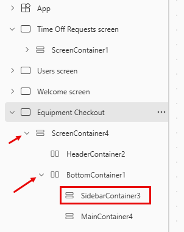

---
lab:
  title: 'Lab 3: Membuat aplikasi kanvas'
  learning path: 'Learning Path: Demonstrate the capabilities of Microsoft Power Apps'
  module: 'Module 2: Build a canvas app'
---
## Tujuan pembelajaran

Dalam latihan ini, Anda akan menggunakan Copilot untuk membuat aplikasi kanvas yang dapat digunakan karyawan untuk meminta dan mengelola waktu libur dan permintaan checkout peralatan. Setelah aplikasi dibuat, Anda akan menggunakan perancang Copilot dan Power Apps untuk mengubah aplikasi.

Setelah berhasil menyelesaikan lab ini, Anda akan:

- Gunakan Copilot untuk membantu Anda membuat model data untuk mendukung aplikasi Anda.
- Ubah aplikasi kanvas.

### Skenario

Contoso Consulting adalah organisasi layanan profesional yang berspesialisasi dalam layanan konsultasi IT dan AI. Mereka ingin membuat aplikasi waktu libur yang dapat digunakan karyawan untuk meminta waktu libur.

### Detail Lab

Sebelum memulai latihan ini, anda harus menyelesaikan lab berikut:

- **Lab 2 – Membuat model data**

> **Penting** Lab ini menggunakan AI untuk membangun komponen. Karena hasil AI dapat bervariasi, penting untuk dicatat bahwa hasil Anda mungkin berbeda (tetapi mirip) dengan apa yang didefinisikan di lab. Konsep dasar yang diuraikan dalam lab akan sama tidak peduli apa yang dibuat atau apa namanya. Jika tabel dan kolom tidak sama persis, Anda mungkin perlu menyesuaikan dengan apa yang dibuat untuk Anda.

Perkiraan waktu untuk menyelesaikan latihan ini adalah **60 hingga 75** menit.

## Tugas 1: Masuk ke Power Apps dan jelajahi antarmuka

1.  Buka browser web dan navigasikan ke [portal pembuat Power Apps](https://make.powerapps.com/) .
1.  Menggunakan navigasi di sebelah kiri, pilih **Buat**.
1.  Di bawah **Buat aplikasi** Anda, pilih **Mulai dengan Salinan**.
1.  **Di layar Jelaskan tabel yang ingin Anda buat salinannya**, ketik:*` I want to store time off requests sent by employees. The table should identify the start and end times of the request.`*
1.  Pilih tombol Opsi** tabel**. Dari menu yang muncul, pilih **Satu Tabel**.

    

1.  Pilih tombol **Hasilkan**.

    Salinan seharusnya telah membuat **tabel Permintaan** Waktu Nonaktif. Selanjutnya, kita akan menambahkan lebih banyak kolom ke tabel.

    **Catatan**: Jika perlu, harap tambahkan Nama tabel untuk diminta.

1.  Di panel **Copilot** , masukkan: *`Add a choice column called Time Off Reason.`*
1.  Di panel **Salinan** , tambahkan perintah berikut secara individual.
    - *`Add a choice column named Time off Type.`*
    - *`Add a Date column called Submission Date.`*
    - *`Add a choice column to the Time Off request table called Approval Status.`*
    - *`Add a multi-line text column called Request Details.`*

    Tabel waktu libur Anda akan menyerupai gambar:

    

    Selanjutnya, kita akan menambahkan tabel pengguna ke model data sehingga kita dapat mengaitkan permintaan waktu libur dengan pengguna tertentu.

1.  Pada bilah **Perintah**, pilih **+ Tabel** yang sudah ada.
1.  Beralih dari **Dikomodasi** Ulang ke **Semua tabel**.
1.  **Di bidang Pencarian**, masukkan **Pengguna**.
1.  **Pilih tabel Pengguna** dan klik tombol **Tambahkan Dipilih**.
1.  Pada bilah **Perintah**, pilih **Buat hubungan**.
1.  Konfigurasikan hubungan sebagai berikut:

    -   **Satu:** Pengguna
    -   **Banyak:** Permintaan Waktu Nonaktif
    -   **Nama tampilan**: `Requesting Employee`
  
1.  Pilih **Selesai**.

    Model data Lengkap Anda harus menyerupai gambar:

    

1.  Pilih tombol **Simpan dan buka aplikasi** .

> [!NOTE]
> Diperlukan waktu beberapa menit agar aplikasi baru Anda dibuat.

## Tugas 2: Mempersonalisasi aplikasi baru Anda

Sekarang setelah aplikasi baru Anda dibuat, kami akan membuat beberapa modifikasi agar paling sesuai dengan kebutuhan kami. Kita akan mulai dengan membuat beberapa modifikasi pada layar Selamat Datang.

1.  Dengan aplikasi baru Anda terbuka, Pilih **tempat penampung Gambar** di atas **teks Permintaan** Waktu Nonaktif.
1.  Dari menu yang muncul, pilih **Edit **** \> Unggah.**
1.  **Pilih gambar Waktu nonaktif** di folder file kelas, lalu pilih **Buka**.
1.  Selanjutnya, pilih **tempat penampung Gambar** di atas **Pengguna**.
1.  Dari menu yang muncul, pilih **Edit **** \> Unggah.**
1.  **Pilih gambar Karyawan** di folder file kelas, lalu pilih **Buka**.

    Selanjutnya, kita akan menyesuaikan ukuran gambar untuk membuatnya lebih mudah dibaca pengguna. Selain itu, kita akan menyesuaikan teks yang ditampilkan untuk setiap item.

1.  Pada bilah **Perintah**, pilih tombol **Properti** . (*Terletak tepat di sebelah kanan tombol Pengeditan.*)
1.  Pilih gambar Waktu nonaktif** yang **Anda tambahkan sebelumnya.
1.  Di panel **Properti** , konfigurasikan gambar sebagai berikut:
    
    -   **Posisi Gambar:** Isi
    -   **Lebar:** 300
    -   **Tinggi:** 300
      
1.  Ulangi langkah sebelumnya untuk mengatur **Tinggi** dan **Lebar** **gambar Karyawan** ke **300** x **300**.
1.  Pilih teks di bawah **Permintaan** Waktu Nonaktif.
1.  Di panel **Properti** , pilih **bidang Teks** , dan ubah teks menjadi: *`Create, View, and Manage you time off requests.`*
1.  Pilih **teks Layar** Selamat Datang di **Header**.
1.  Di panel **Properti** di sebelah kanan, pilih **bidang Logo** .
1.  Dari menu yang muncul, pilih **Unggah**.
1. Pilih **Logo** Contoso dari file kelas Anda dan pilih **Buka**.
1. Di panel **Properti** di bawah **Grup gaya** dan tema, pilih **ikon Warna isian** .
1. Pilih tab **Kustom**
1. **Ubah warna Hex** menjadi:`101E2B`
1. Pastikan Anda masih memilih **Header** , dan ubah **Judul** menjadi `Contoso Employee Hub`.
1. Pada bilah **Perintah** , pilih tombol **Simpan** untuk menyimpan aplikasi.
1. **Di layar Simpan**, atur **Nama** ke `Contoso Employee Hub`, dan pilih **Simpan.**

    Aplikasi Anda akan menyerupai gambar.

    

## Tugas 3: Tambahkan layar baru ke aplikasi Anda.

Saat Anda membangun aplikasi, salah satu manajer Anda menghubungi Anda dan bertanya-tanya apakah karyawan juga dapat menggunakan aplikasi ini untuk memeriksa peralatan. Contoso sudah menyimpan informasi cek keluar peralatan di Dataverse, jadi hanya masalah membuat informasi tersedia di aplikasi.

1.  Dengan aplikasi Anda masih terbuka, perluas panel **Copilot** (jika perlu). Di Copilot, masukkan yang berikut ini: *`Add a new screen called Equipment Checkout.`*
1.  Pilih **Kirim**.
1.  Pilih tombol **Pertahankan** untuk menerima layar.
1.  Layar baru bernama **Equipment Checkout** ditambahkan ke aplikasi Anda.
1.  Saat berada **di layar Cek Keluar** Peralatan, klik **Dengan tata letak**, dan pilih **tata letak Bilah** Samping.
1.  Perluas kontainer yang berbeda hingga **SideBarContainer** terlihat.

    

1.  **Klik kanan SidebarContainer** dan ganti nama menjadi **EquipContainer1**.
1.  **Dengan kontainer EquipContainer1** dipilih, klik tombol **buka menu** sisipkan.
1.  Di jendela **Pencarian** , masukkan **Galeri**, dan pilih **Galeri** vertikal.
1.  Ketika Anda diminta troi menyediakan sumber data di bidang Pencarian** yang muncul, masukkan **Peralatan**, dan pilih **tabel Peralatan**.**
1. Di **Tampilan** Pohon di sisi kiri layar, pilih **kontrol Gallery1** yang baru saja Anda tambahkan.
1. Klik kanan nama Galeri, pilih **Ganti Nama**, dan ganti nama menjadi `Equipment List`.
1. Arahkan mouse ke **galeri Daftar** Peralatan, pada toolbar yang muncul di atas galeri, pilih **Tata Letak**.
1. Pilih **opsi Judul dan tata letak** subtitel.
1. **Dengan galeri Daftar** Peralatan dipilih, di panel **Properti**, konfigurasikan sebagai berikut:

    -   **Lebar:** `360`
    -   **Tinggi fleksibel:** Aktif
    -   **Tinggi minimum:** `287`

    Selanjutnya, kita akan menambahkan kontainer tambahan ke **kontainer EquipmentContiner1** untuk menyimpan kontrol pencarian yang akan kita gunakan untuk memfilter konten **galeri Daftar** Peralatan.

1.  Di **Tampilan pohon** , pilih **EquipContainer1**.
1.  Arahkan mouse ke atas kontainer dan pilih **ikon Copilot** .
1.  Masukkan teks berikut: *`Insert a Horizontal container.`*

    

1.  Pilih tombol **Pertahankan** .
1.  Kontainer baru akan ditambahkan ke bagian **bawah kontainer EquipContainer1** .
1.  **Di Tampilan** Pohon, klik, tahan, dan seret kontainer baru, dan letakkan di atas **galeri Daftar** Peralatan.
1.  Ganti nama kontainer menjadi `EquipSearchContainer`.
1.  **Dengan EquipSearchContainer** dipilih, di panel **Properti**, konfigurasikan sebagai berikut:
    
    -   **Lebar minimum:** `0`
    -   **Tinggi fleksibel:** Nonaktif
    -   **Tinggi:** `44`
    
1.  Dengan **EquipSearchContainer** dipilih, pilih tombol **buka menu** sisipkan.
1. **Di bidang Pencarian**, masukkan **Teks**, dan pilih **Input teks**.
1. Ganti nama **bidang Input** Teks, menjadi `EquipSearchInput`.
1. Dengan **EquipSearchInput** dipilih, di panel **Properti** , konfigurasikan sebagai berikut:

    -   **Default:** Kosong (tidak ada)
    -   **Teks petunjuk:** Pencarian
    -   **Font:** Buka Sans
    -   **Ukuran font:** 14
    -   **Padding** (Nilai di bawah ini mungkin sudah ada.)
        -   **Atas:** 5
        -   **Bawah:** 5
        -   **Kiri:** 12
        -   **Kanan:** 5
    -   **Tinggi:** 44
    -   **Lebar fleksibel:** Aktif
    -   **Lebar minimum:** 0

        

1. Di **Tampilan** Pohon, pilih **EquipSearchContainer.**
1. Arahkan mouse ke atas kontainer, pilih **ikon Copilot** , dan masukkan *`Add a Search Icon.`*
1. Pilih **Simpan**.

    > **Catatan:** Jika Copilot terjadi untuk menambahkan ikon yang salah, hapus dan masukkan kaca pembesar secara manual.

1. **Dengan ikon Pencarian** dipilih, di panel **Properti**, konfigurasikan kontrol sebagai berikut:

    -   **Padding**
        -   **Atas:** 10
        -   **Botton:** 10
        -   **Kiri:** 10
        -   **Kanan:** 10
    -   **Tinggi:** 44
    -   **Lebar:** 44

    

1. **Menggunakan tampilan** Pohon di sebelah kiri, pilih **EquipSearchContainer.**

    Terakhir, kita akan mengonfigurasi **galeri Daftar** Peralatan untuk mengisi datanya berdasarkan teks yang dimasukkan di bidang kontrol pencarian.

1.  Pilih galeri Daftar** Peralatan yang **kami buat sebelumnya.
1.  **Di properti Item**, masukkan rumus berikut ini:`Search([@'Equipments'], EquipSearchInput.Text, 'Equipment Name',Category)`

    

1. Pada bilah **Perintah** , pilih tombol **Simpan** untuk menyimpan aplikasi Anda.

> **Penting:** Jika Anda menyalin dan menempelkan rumus ke bilah rumus, ada kemungkinan '' salah untuk Nama Peralatan dan Peralatan. Jika Anda mendapatkan kesalahan rumus, coba hapus dan ketik ulang.

## Tugas 4: Buat kontainer untuk menampilkan operasi rekaman.

Saat pengguna memilih rekaman dalam daftar Peralatan, kami ingin membuka rekaman di kontainer lain untuk memungkinkan mereka mengedit rekaman yang dipilih.

1.  **Pilih MainContainer** dan ganti namanya menjadi `DetailsContainer`.
1.  **Pada DetailsContainer**, pilih tombol **Sisipkan**.
1.  Dalam Pencarian** yang **diajukan, masukkan **Kontainer**, dan pilih **Kontainer** Vertikal.
1.  Klik kanan dan **Ganti nama** kontainer menjadi `RecordDetails`.
1.  **Pada kontainer RecordDetails**, pilih tombol **Sisipkan**.
1.  Pada menu **Sisipkan** , pilih **Edit formulir**.
1.  Di layar pilih sumber data, pilih **Peralatan**. *(Dibutuhkan waktu hingga 30 detik agar data terisi.)*
1.  Klik kanan formulir yang baru saja Anda tambahkan dan **Ganti namanya** menjadi `EquipmentForm`.
1.  Di panel **Properti** , pilih tab **Tingkat Lanjut** dan atur **properti Item** ke: `'Equipment List'.Selected` *(Ini akan mengisi formulir dengan rekaman yang saat ini dipilih.)*
1. Pilih tab **Tampilan** , dan konfigurasikan formulir sebagai berikut:

    -   **Kolom:** 2
    -   **Mode Default:** Edit

    Sekarang kita akan menambahkan kontainer lain yang akan digunakan untuk mengontrol operasi pada formulir.

1.  Pastikan Anda memilih **DetailsContainer** .
1.  Pilih **ikon Copilot** yang muncul. Masukkan yang berikut ini: *`Insert a horizontal container.`*
1.  Pilih **Simpan**.
1.  Klik kanan kontainer, dan **Ganti namanya** menjadi `SelectedRecord1`
1.  Menggunakan **tampilan Pohon** , pindahkan **kontainer SelectedRecord1** di atas **kontainer RecordDetails** .
1.  Konfigurasikan **kontainer SelectedRecord1** sebagai berikut:
    
    -   **Lebar minimum:** 250
    -   **Tinggi fleksibel:** Nonaktif
    -   **Tinggi:** 50
    
1.  **Dengan kontainer SelectedRecord1**dipilih, pilih tombol **Sisipkan**.
1.  Pilih **Label Teks.**
1.  Ganti nama label menjadi `SelectedRecordTitle`.
1. Konfigurasikan **SelectedRecordTitle** sebagai berikut:

    1.  **Padding**
        1.  **Atas:** 5
        2.  **Bawah:** 5
        3.  **Kiri:** 30
        4.  **Kanan:** 5
    2.  **Lebar fleksibel:** Aktif
    3.  **Lebar minimum:** 150
    4.  **Tinggi:** 40
       
1. **Pilih kontainer SecondRecord1**, Pilih tombol **Sisipkan**.
1. **Di bidang Pencarian**, masukkan **Simpan**, dan pilih **ikon Simpan**.
1. Konfigurasikan tombol **Simpan** sebagai berikut:

    -   **Tinggi:** 40
    -   **Lebar:** 40
      
1. **Pilih properti OnSelect** dan masukkan rumus berikut: `SubmitForm(EquipmentForm)`.

    

## Tugas 5: Ubah Header di Halaman

Langkah terakhir dalam membuat layar ini adalah mengisi kontainer pembaca dengan data.

1.  **Pilih HeaderContainer** di bagian atas aplikasi.
1.  Pilih tombol **Sisipkan** .
1.  Pilih **Label teks**.
1.  Konfigurasikan **kontrol label** Teks sebagai berikut:
   
    -   **Teks:** `Equipment Checkout`
    -   **Font:** Buka Sans
    -   **Ukuran Font:** 16
    -   **Bobot font:** Semibold
    -  **Padding**
        -   **Atas:** 16
        -   **Bawah:** 16
        -   **Kiri:** 16
        -   **Kanan:** 16
    -   **Tinggi:** 40
    -   **Lebar fleksibel:** Aktif

        

1.  **Pilih HeaderContainer**, pilih **Sisipkan**, dan pilih **Ikon** Beranda.
1.  Atur **properti OnSelect** dari tombol beranda ke: `Back()`

    

## Tugas 6: Selesai mengonfigurasi layar Selamat Datang

Setelah ditinjau, kami telah memutuskan bahwa kami tidak perlu memiliki kemampuan untuk membuat pengguna di aplikasi ini, jadi kami akan mengubah Layar Selamat Datang untuk memungkinkan Anda mengakses checkout peralatan.

1.  Menggunakan **tampilan** Pohon, pilih **Layar** Selamat Datang.
1.  Pilih Gambar** di **atas **Pengguna**.
1.  Dari menu yang muncul, pilih **Edit**, dan pilih **Unggah**.
1.  **Temukan gambar Peralatan** di folder siswa Anda dan pilih **Buka**.
1.  Atur **properti OnSelect** gambar ke: `Navigate('Equipment Checkout')`
1.  **Pilih teks Pengguna** dan atur **properti Teks** ke `Equipment`.
1.  Pilih Teks di bawah Peralatan dan ubah **properti Teks** menjadi: `Check out equipment and edit reservations`.** ******

    

1. Pilih tombol **Simpan** untuk menyimpan aplikasi Anda.

## Tugas 7: Uji aplikasi Anda

1.  Pada bilah **Perintah**, pilih tombol **Putar** .
1.  Pilih **gambar Peralatan** .
1.  **Di bidang Pencarian**, masukkan **Elektronik**. (*Perhatikan bagaimana daftar filter*)
1.  Pilih **rekaman Laptop** .
1.  **Ubah Kategori** menjadi **Furnitur**.
1.  Pilih tombol **Simpan**.
1.  Perhatikan bagaimana kategori Laptop** berubah menjadi ****Furniture**.
1.  Pilih tombol **Beranda** .
1.  **Pilih Purple X** untuk meninggalkan **mode Pratinjau**.

## Tugas 8: Menyimpan dan menerbitkan aplikasi

**Tujuan:** Simpan dan terbitkan aplikasi agar dapat diakses di seluruh browser web, perangkat seluler, atau platform yang disematkan seperti SharePoint atau Teams.

1.  Di Power Apps Studio, pilih tombol **Simpan** .
1.  Klik tombol **Terbitkan**.
1.  Pilih **Terbitkan versi ini.**

