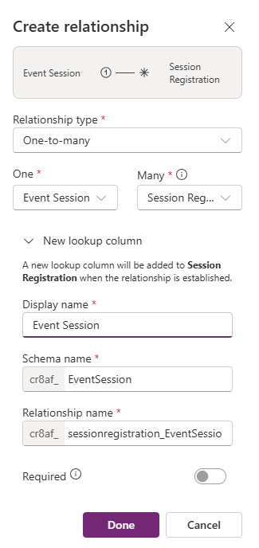

---
lab:
  title: 'Lab 3: Membuat model data'
  learning path: 'Learning Path: Manage the Microsoft Power Platform environment'
  module: 'Module 1: Describe Microsoft Dataverse'
---

## Tujuan pembelajaran

Dalam latihan ini, pelajar akan menggunakan Copilot untuk membangun model data. Anda akan memberikan deskripsi jenis tabel yang ingin Anda buat dan gunakan perancang untuk membuat perubahan sesuai kebutuhan seperti menambahkan kolom tambahan.

Setelah berhasil menyelesaikan lab ini, Anda akan:

- Gunakan Copilot untuk membantu Anda membuat model data.
- Tambahkan dan edit kolom ke tabel.

### Skenario

Contoso Consulting adalah organisasi layanan profesional yang berspesialisasi dalam layanan konsultasi IT dan AI. Sepanjang tahun, mereka menawarkan banyak acara yang berbeda kepada pelanggan mereka. Beberapa di antaranya adalah acara gaya pameran dagang di mana mereka memiliki banyak mitra masuk dan memberikan detail tentang produk baru, tren pasar, dan layanan. Yang lain terjadi sepanjang tahun dan merupakan webinar cepat yang digunakan untuk memberikan detail tentang masing-masing produk.

Contoso ingin menggunakan Power Platform untuk membangun solusi Manajemen Peristiwa yang dapat mereka gunakan untuk mengelola berbagai peristiwa yang mereka host sepanjang tahun.

Dalam latihan ini Anda akan membuat mode data yang akan digunakan untuk menyimpan berbagai jenis peristiwa, pendaftaran peristiwa, dan data lain yang diperlukan contoso untuk mengelola peristiwa mereka secara efektif.

### Detail Lab

Sebelum memulai latihan ini, Disarankan agar selesai:

- **Lab 2 – Membuat Solusi Power Platform**

> [!IMPORTANT]
> Lab ini menggunakan AI untuk membangun komponen. Karena hasil AI dapat bervariasi, penting untuk dicatat bahwa hasil Anda mungkin berbeda (tetapi mirip) dengan apa yang didefinisikan di lab. Konsep dasar yang diuraikan dalam lab akan sama tidak peduli apa yang dibuat atau apa namanya. Jika tabel dan kolom tidak sama persis, Anda mungkin perlu menyesuaikan dengan apa yang dibuat untuk Anda.

### Waktu Lab

Perkiraan waktu untuk menyelesaikan latihan ini adalah **20 hingga 30** menit.

> [!NOTE]
> Di lab sebelumnya, kami membuat solusi Manajemen Peristiwa dan menetapkannya sebagai solusi yang disukai di lingkungan ini. Untuk alasan itu, kita tidak perlu langsung masuk ke solusi untuk membuat model data kita. Item yang kita buat akan secara otomatis ditambahkan ke solusi.

## Tugas 1: Membuat model data

Contoso saat ini menyimpan informasi kontak doner dalam instans Dataverse mereka. Mereka ingin menggunakan Dataverse untuk melacak hibah yang mereka ajukan dan sumbangan yang mereka terima. Anda perlu membuat tabel yang diperlukan untuk mendukung kebutuhan aplikasi Contoso di masa mendatang.

1.  Jika perlu, buka browser web dan navigasikan ke [portal pembuat Power Apps](https://make.powerapps.com/) , dan Masuk menggunakan kredensial akun Microsoft Anda.
2.  Menggunakan navigasi di sebelah kiri, pilih **Tabel**.
3.  Di bawah **Tabel**, pilih **Mulai menggunakan Copilot**.
4.  **Di layar Jelaskan tabel yang ingin Anda buat salinannya**, Masukkan: "*Buat tabel untuk mengelola Peristiwa. Tabel harus mengidentifikasi nama peristiwa, data peristiwa, jumlah maksimum peserta, dan detail acara."*
5.  Di samping tombol **Hasilkan** , pilih **Pengaturan** Tabel, dan konfigurasikan sebagai berikut:
    - **Opsi Tabel:** Satu tabel
    - JANGAN **** sertakan hubungan.

6.  Pilih tombol **Hasilkan**.

> [!IMPORTANT]
> Salinan hanya boleh membuat satu tabel yang disebut Peristiwa. Jika lebih banyak yang dibuat, Anda dapat menghapusnya, dengan memberi tahu Copilot nama tabel untuk dihapus.

**Mengedit model data dengan Copilot**

Sekarang setelah kita membuat tabel, kita akan menambahkan beberapa kolom tambahan ke dalamnya. Kita akan mulai dengan menambahkan kolom jenis peristiwa. Selain itu, Kontak akan menghadiri acara kami. Kami ingin menambahkan tabel Kontak yang ada ke model data dan mengaitkannya dengan Pendaftaran Peristiwa nanti.

1.  **Di bidang Apa yang ingin Anda lakukan nex**t, masukkan: "*Tambahkan kolom pilihan bernama jenis peristiwa"*
2.  Tambahkan kolom lain dengan memasukkan teks berikut: "*Tambahkan kolom pilihan bernama pendaftaran diperlukan*"

Selanjutnya, Mari kita tambahkan **tabel Kontak** ke model data.

3.  Di bilah **** Perintah di bagian atas, pilih **+ Tabel yang Sudah Ada.**
4.  **Di bidang Pencarian**, masukkan **Kontak**, dan pilih **Tambahkan dipilih**.

Bergantung pada jenis peristiwa, mungkin ada satu atau beberapa sesi. Untuk mengelola sesi yang berbeda, kita perlu menentukan apa sesi dan peristiwa yang terkait dengan sesi tersebut. Selanjutnya kita akan menggunakan Copilot untuk membuat tabel Sesi Peristiwa.

5.  **Di bidang Apa yang ingin Anda lakukan berikutnya**, Masukkan: "*Tambahkan tabel baru yang disebut sesi peristiwa."*

Copilot kemungkinan akan membuat dua tabel, Sesi Peristiwa dan Pembicara Peristiwa. Karena Kontak kami akan menjadi pembicara, kami akan menghapus tabel Pembicara Peristiwa.

6.  Jika perlu, di **bidang Apa yang ingin Anda lakukan berikutnya** , Masukkan: "*Hapus tabel Pembicara Peristiwa."*
7.  Di Copilot, masukkan teks berikut: "*Tambahkan kolom teks baru ke tabel Sesi Peristiwa yang disebut deskripsi sesi."*

Selanjutnya, kita akan menambahkan satu tabel terakhir yang disebut Pendaftaran Sesi, Tabel ini akan digunakan untuk mengelola individu yang mendaftar untuk sesi tertentu.

8.  Di Copilot, masukkan teks berikut: *"Tambahkan tabel baru yang disebut pendaftaran sesi."*

    Salinan kemungkinan akan membuat dua tabel, Pendaftaran Sesi, Sesi, atau Peserta. Karena Kontak kami bisa menjadi Peserta, kami akan menghapus tabel Peserta. Jika ada tabel lain (Sesi tersebut) selain Pendaftaran Sesi yang dibuat, hapus tabel tersebut.

9.  Di Salinan, masukkan teks berikut: "*Hapus tabel Peserta."*
10.  Di Copilot, masukkan teks berikut: "*Tambahkan kolom teks ke tabel Pendaftaran sesi yang disebut instruksi khusus."*

Sekarang kita akan membuat hubungan antara tabel kita yang berbeda. Karena rekaman Kontak dapat menjadi pembicara dalam sesi, kami akan membuat hubungan antara tabel Kontak dan Sesi Peristiwa.

11.  Pada bilah Perintah, pilih **Buat hubungan**.
12.  Konfigurasikan hubungan sebagai berikut:
    - **Jenis Hubungan:** Satu-ke-banyak
    - **Satu:** Kontak
    - **Banyak:** Sesi Peristiwa
    - **Nama tampilan:** Pembicara
13.  Pilih **Selesai**.

Karena kontak dapat didaftarkan untuk sesi dalam sesi, kami akan membuat hubungan antara tabel Kontak dan Pendaftaran Sesi.

14.  Pada bilah **Perintah**, pilih **Buat hubungan**.
15.  Konfigurasikan hubungan sebagai berikut:
    - **Jenis Hubungan:** Satu-ke-banyak
    - **Satu:** Kontak
    - **Banyak:** Pendaftaran Sesi
    - **Nama tampilan:** Peserta

16.  Pilih **Selesai**.

Satu peristiwa dapat memiliki beberapa sesi yang terkait dengannya, jadi kami akan membuat hubungan antara tabel Peristiwa dan Sesi Peristiwa.

17.  Pada bilah **Perintah**, pilih **Buat hubungan**.
18.  Konfigurasikan hubungan sebagai berikut:
    - **Jenis Hubungan:** Satu-ke-banyak
    - **Satu:** Peristiwa
    - **Banyak:** Sesi Peristiwa
    - **Nama tampilan:** Peristiwa

Terakhir, Peserta mendaftar untuk Sesi Acara, jadi kita perlu membuat hubungan antara tabel Sesi Acara dan Pendaftaran Sesi.

19.  Pada bilah **Perintah**, pilih **Buat hubungan**.
20.  Konfigurasikan hubungan sebagai berikut:
    - **Jenis Hubungan:** Satu-ke-banyak
    - **Satu:** Sesi Peristiwa
    - **Banyak:** Pendaftaran Sesi
    - **Nama tampilan:** Sesi Peristiwa

21.  Pilih **Selesai**.

Model data yang baru dibuat harus menyerupai gambar:

22.  Pilih **Simpan dan keluar.**

## Tugas 2: Mengedit tabel dan kolom secara langsung

Copilot adalah cara yang luar biasa untuk membuat tabel dan kolom dengan sangat cepat. Namun, mungkin ada kalanya Anda perlu melakukan modifikasi pada tabel dan kolom secara langsung. Misalnya, dalam tugas ini kita akan memperbarui beberapa kolom yang ada, serta melacak berapa banyak peserta yang terdaftar untuk sesi tertentu.

1.  Jika perlu, buka browser web dan navigasikan ke [portal pembuat Power Apps](https://make.powerapps.com/) , dan Masuk menggunakan kredensial akun Microsoft Anda.
2.  Menggunakan navigasi di sebelah kiri, pilih **Tabel**.
3.  **Di bidang Pencarian**, masukkan **Peristiwa**.
4.  **Buka tabel Peristiwa**.
5.  Di bawah judul **Skema** , pilih **Kolom**.
6.  Temukan dan buka **kolom Jenis** Peristiwa.
7.  Ganti Label dengan yang berikut ini:
    - Konferensi
    - Seminar Web
    - Makan Siang dan Belajar
    - Launch
8.  Atur **Pilihan** default ke **Tidak Ada**.

9.  Pilih tombol **Simpan**. (*Jika kolom gagal disimpan, pertama kali, coba lagi.*)

Selanjutnya kita akan menambahkan kolom baru ke **tabel Sesi** Peristiwa untuk melacak jumlah total pendaftaran sesi.

10.  Menggunakan navigasi di sebelah kiri, pilih **Tabel**.
11.  **Di bidang Pencarian**, masukkan **Peristiwa**.
12.  **Buka tabel Sesi** Peristiwa.
13.  Di bawah judul **Skema** pilih **Kolom**.
14.  Pada bilah perintah, pilih tombol **Kolom** Baru.
15.  Konfigurasikan kolom baru sebagai berikut:
    - **Nama Tampilan:** Total Pendaftaran
    - **Jenis data:** Bilangan Bujur
    - **Perilaku**: Rollup

16.  Pilih **Simpan dan edit**.

> [!IMPORTANT]
> Jika pemblokir pop-up diaktifkan, Anda mungkin perlu menonaktifkannya agar bidang roll-up ditampilkan.

17.  Konfigurasikan Kolom Rollup sebagai berikut:
    - Di bawah **Entitas** Terkait, pilih **tambahkan entitas** terkait.
    - **Pilih tabel Pendaftaran** Sesi.
    - Pilih tombol **Simpan perubahan** Anda (*Tanda* centang)
    - Di bawah **Agregasi**, pilih **Tambahkan agregasi**.
    - Di bawah **Fungsi** Agregat, pilih **Hitung**.
    - Untuk **bidang Entitas** Terkait Agregat, pilih **Pendaftaran** Sesi.
    - Pilih tombol ***Simpan perubahan** Anda (Tanda centang)*

18.  Pilih tombol **Simpan dan tutup** .

Anda sekarang telah berhasil membuat tabel dan kolom di Microsoft Dataverse menggunakan Copilot.
