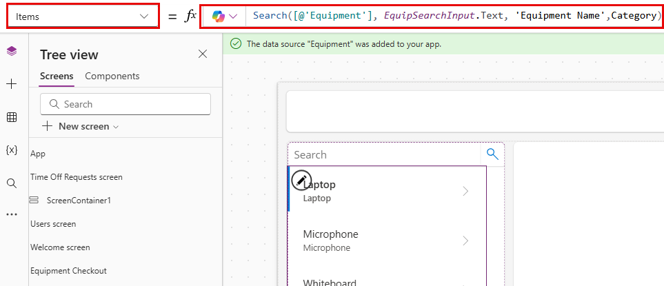

---
lab:
  title: 'Lab 4: Membuat aplikasi kanvas'
  learning path: 'Learning Path: Demonstrate the capabilities of Microsoft Power Apps'
  module: 'Module 2: Build a canvas app'
---
## Tujuan pembelajaran

Dalam latihan ini, Anda akan menggunakan Copilot untuk membuat aplikasi kanvas yang dapat digunakan karyawan untuk meminta dan mengelola waktu libur dan permintaan checkout peralatan. Setelah aplikasi dibuat, Anda akan menggunakan perancang Copilot dan Power Apps untuk mengubah aplikasi.

Setelah berhasil menyelesaikan lab ini, Anda akan:

- Gunakan Copilot untuk membantu Anda membuat model data untuk mendukung aplikasi Anda.
- Ubah aplikasi kanvas.

### Skenario

Contoso Consulting adalah organisasi layanan profesional yang berspesialisasi dalam layanan konsultasi IT dan AI. Mereka ingin membuat aplikasi waktu libur yang dapat digunakan karyawan untuk meminta waktu libur.

### Detail Lab

Sebelum memulai latihan ini, anda harus menyelesaikan lab berikut:

- **Lab 1 – Membuat solusi dengan Perancang Rencana**

> [!IMPORTANT]
> Lab ini menggunakan AI untuk membangun komponen. Karena hasil AI dapat bervariasi, penting untuk dicatat bahwa hasil Anda mungkin berbeda (tetapi mirip) dengan apa yang didefinisikan di lab. Konsep dasar yang diuraikan dalam lab akan sama tidak peduli apa yang dibuat atau apa namanya. Jika tabel dan kolom tidak sama persis, Anda mungkin perlu menyesuaikan dengan apa yang dibuat untuk Anda.*

Perkiraan waktu untuk menyelesaikan latihan ini adalah **45 hingga 60** menit.

## Tugas 1: Masuk ke Power Apps dan jelajahi antarmuka

1.  Buka browser web dan navigasikan ke [portal pembuat Power Apps](https://make.powerapps.com/) .
2.  Menggunakan navigasi di sebelah kiri, pilih **Buat**.
3.  Di bawah **Buat aplikasi** Anda, pilih **Mulai dengan Salinan**.
4.  **Di layar Jelaskan tabel yang ingin Anda buat salinannya**, ketik: " Saya ingin menyimpan permintaan waktu libur yang dikirim oleh karyawan. Tabel harus mengidentifikasi waktu mulai dan berakhir permintaan."
5.  Pilih tombol Opsi** tabel**. Dari menu yang muncul, pilih **Satu Tabel**.

6.  Pilih tombol **Hasilkan**.

Salinan seharusnya telah membuat **tabel Permintaan** Waktu Nonaktif. Selanjutnya, kita akan menambahkan lebih banyak kolom ke tabel.

7.  Di panel **Salinan** , masukkan: *"Tambahkan kolom pilihan yang disebut Alasan Waktu Nonaktif."*
8.  Di panel **Salinan** , tambahkan perintah berikut secara individual.
    - *"Tambahkan kolom pilihan bernama Jenis Waktu Nonaktif."*
    - *"Tambahkan kolom Tanggal yang disebut Tanggal Pengiriman."*
    - *"Tambahkan kolom pilihan ke tabel permintaan Waktu Nonaktif yang disebut Status Persetujuan."*
    - *"Tambahkan kolom teks multibaris yang disebut Detail Permintaan."*

    Tabel waktu libur Anda akan menyerupai gambar:

Selanjutnya, kita akan menambahkan tabel pengguna ke model data sehingga kita dapat mengaitkan permintaan waktu libur dengan pengguna tertentu.

9.  Pada bilah **Perintah**, pilih **+ Tabel** yang sudah ada.
10.  Beralih dari **Direkomodasi** ke **Semua Tabel**.
11.  **Di bidang Pencarian**, masukkan **Pengguna**.
12.  **Pilih tabel Pengguna** dan klik tombol **Tambahkan Dipilih**.
13.  Pada bilah **Perintah**, pilih **Buat hubungan**.
14.  Konfigurasikan hubungan sebagai berikut:
    -   **Satu:** Pengguna
    -   **Banyak:** Permintaan Waktu Nonaktif
    -   **Nama Tampilan:** Meminta Karyawan
15.  Pilih **Selesai**.

Model data Lengkap Anda harus menyerupai gambar di bawah ini:

16.  Pilih tombol **Simpan dan buka aplikasi** .

> [!NOTE]
> Diperlukan waktu beberapa menit agar aplikasi baru Anda dibuat.

## Tugas 2: Mempersonalisasi aplikasi baru Anda

Sekarang setelah aplikasi baru Anda dibuat, kami akan membuat beberapa modifikasi agar paling sesuai dengan kebutuhan kami. Kita akan mulai dengan membuat beberapa modifikasi pada layar Selamat Datang.

1.  Dengan aplikasi baru Anda terbuka, Pilih **tempat penampung Gambar** di atas **teks** Permintaan** Waktu Nonaktif.**
2.  Dari menu yang muncul, pilih **Edit **** \> Unggah.**
3.  **Pilih gambar Waktu nonaktif** di folder file kelas, lalu pilih **Buka**.
4.  Selanjutnya, pilih **tempat penampung Gambar** di atas **Pengguna**.
5.  Dari menu yang muncul, pilih **Edit **** \> Unggah.**
6.  **Pilih gambar Karyawan** di folder file kelas, lalu pilih **Buka**.

Selanjutnya, kita akan menyesuaikan ukuran gambar untuk membuatnya lebih mudah dibaca pengguna. Selain itu, kita akan menyesuaikan teks yang ditampilkan untuk setiap item.

7.  Pada bilah **Perintah**, pilih tombol **Properti** . (*Terletak tepat di sebelah kanan tombol Pengeditan.*)
8.  Pilih gambar Waktu nonaktif** yang **Anda tambahkan sebelumnya.
9.  Di panel **Properti** , konfigurasikan gambar sebagai berikut:
    -   **Posisi Gambar:** Isi
    -   **Lebar:** 300
    -   **Tinggi:** 300
10.  Ulangi langkah sebelumnya untuk mengatur **Tinggi** dan **Lebar** **gambar Karyawan** ke **300** x **300**.
11.  Pilih teks di bawah **Permintaan** Waktu Nonaktif.
12.  Di panel **Properti** , pilih **bidang Teks** , dan ubah teks menjadi: *"Buat, Tampilkan, dan Kelola permintaan waktu libur Anda."*
13.  Pilih **teks Layar** Selamat Datang di **Header**.
14.  Di panel **Properti** di sebelah kanan, pilih **bidang Logo** .
15.  Dari menu yang muncul, pilih **Unggah**.
16. Pilih **Logo** Contoso dari file kelas Anda dan pilih **Buka**.
17. Di panel **Properti** di bawah **Grup gaya** dan tema, pilih **ikon Warna isian** .
18. Pilih tab **Kustom**
19. **Ubah warna Hex** menjadi: **101E2B**
20. Pastikan Anda masih memilih **Header** , dan mengubah **Judul**, menjadi Hub Karyawan Contoso

Aplikasi Anda akan menyerupai gambar.

## Tugas 3: Tambahkan layar baru ke aplikasi Anda.

Saat Anda membangun aplikasi, salah satu manajer Anda menghubungi Anda dan bertanya-tanya apakah karyawan juga dapat menggunakan aplikasi ini untuk memeriksa peralatan. Contoso sudah menyimpan informasi cek keluar peralatan di Dataverse, jadi hanya masalah membuat informasi tersedia di aplikasi.

1.  Dengan aplikasi Anda masih terbuka, Jika perlu, perluas panel **Copilot** . Di Copilot masukkan yang berikut ini: "*Tambahkan layar baru yang disebut Equipment Checkout."*  Pilih **Kirim***.*
2.  Pilih tombol **Pertahankan** untuk menerima layar.
3.  Layar baru bernama **Equipment Checkout** ditambahkan ke aplikasi Anda.
4.  Saat berada **di layar Cek Keluar** Peralatan, klik **Dengan tata letak**, dan pilih **tata letak Bilah** Samping.
5.  Perluas kontainer yang berbeda hingga **SideBarContainer** terlihat **.**

6.  **Klik kanan SidebarContainer** dan ganti nama menjadi **EquipContainer1**.
7.  **Dengan kontainer EquipContainer1** dipilih, klik tombol **buka menu** Sisipkan.
8.  Di jendela **Pencarian** , masukkan **Galeri**, dan pilih **Galeri** vertikal.
9.  **Di bidang Pencarian**, masukkan **Peralatan**, dan pilih **tabel Peralatan**.
10. Di **Tampilan** Pohon di sisi kiri layar, pilih **kontrol Gallery1** yang baru saja Anda tambahkan.
11. Klik kanan nama Galeri, pilih **Ganti Nama**, dan ganti nama menjadi **Daftar** Peralatan.
12. Arahkan mouse ke **galeri Daftar** Peralatan, pada toolbar yang muncul di atas galeri, pilih **Tata Letak**.
13. Pilih **opsi Judul dan tata letak** subtitel.
14. **Dengan galeri Daftar** Peralatan dipilih, di panel **Properti**, konfigurasikan sebagai berikut:
    -   **Lebar:** 360
    -   **Tinggi fleksibel:** Aktif
    -   **Tinggi minimum:** 287

Selanjutnya, kita akan menambahkan kontainer tambahan ke **kontainer EquipmentContiner1** untuk menyimpan kontrol pencarian yang akan kita gunakan untuk memfilter konten **galeri Daftar** Peralatan.

15.  Di **Tampilan pohon** , pilih **EquipContainer1**.
16.  Arahkan mouse ke atas kontainer dan pilih **ikon Copilot** .
17.  Masukkan teks berikut: "*Sisipkan kontainer Horizontal.*"

18.  Pilih tombol **Pertahankan** .
19.  Kontainer baru akan ditambahkan ke bagian **bawah kontainer EquipContainer1** .
20.  **Di Tampilan** Pohon, klik, tahan, dan seret kontainer baru, dan letakkan di atas **galeri Daftar** Peralatan.
21.  Ganti nama kontainer menjadi **EquipSearchContainer.**
22.  **Dengan EquipSearchContainer** dipilih, di panel **Properti**, konfigurasikan sebagai berikut:
    -   **Lebar minimum:** 0
    -   **Tinggi fleksibel:** Nonaktif
    -   **Tinggi:** 44
23.  Dengan **EquipSearchContainer** dipilih, pilih tombol **menu** Buka Sisipkan.
24. **Di bidang Pencarian**, masukkan **Teks**, dan pilih **Input** Teks.
25. Ganti nama **bidang Input** Teks, menjadi **EquipSearchInput**.
26. Dengan **EquipSearchInput** dipilih, di panel **Properti** , konfigurasikan sebagai berikut:
    -   **Default:** Kosong (tidak ada)
    -   **Teks petunjuk:** Pencarian
    -   **Font:** Buka Sans
    -   **Ukuran font:** 14
    -   **Padding**
        -   **Atas:** 5
        -   **Bawah:** 5
        -   **Kiri:** 12
        -   **Kanan:** 5
    -   **Tinggi:** 44
    -   **Lebar fleksibel:** Aktif
    -   **Lebar minimum:** 0

        

27. Di **Tampilan** Pohon, pilih **EquipSearchContainer.**
28. Arahkan mouse ke atas kontainer, pilih **Ikon Salinan** , dan masukkan *"Tambahkan Ikon Pencarian."*
29. Pilih **Simpan**.
30. **Dengan ikon Pencarian** dipilih, di panel **Properti**, konfigurasikan kontrol sebagai berikut:
    -   **Padding**
        -   **Atas:** 10
        -   **Botton:** 10
        -   **Kiri:** 10
        -   **Kanan:** 10
    -   **Tinggi:** 44
    -   **Lebar:** 44

31. **Menggunakan tampilan** Pohon di sebelah kiri, pilih **EquipSearchContainer.**
32. Di panel **Properti** , konfigurasikan kontainer sebagai berikut:
    -   **Lebar minimum:** 0
    -   **Tinggi:** 44

Terakhir, kita akan mengonfigurasi **galeri Daftar** Peralatan untuk mengisi datanya berdasarkan teks yang dimasukkan di bidang kontrol pencarian.

33.  Pilih galeri Daftar** Peralatan yang **kami buat sebelumnya.
34.  **Di properti Item**, masukkan rumus berikut: Search([@'Equipment'], *EquipSearchInput*. Teks, 'Nama Peralatan',Kategori)

## Tugas 4: Buat kontainer untuk menampilkan operasi rekaman.

Saat pengguna memilih rekaman dalam daftar Peralatan, kami ingin membuka rekaman di kontainer lain untuk memungkinkan mereka mengedit rekaman yang dipilih.

1.  **Pilih MainContainer**.
2.  **Pada MainContainer**, pilih tombol **menu** Buka Sisipkan.
3.  Dalam Pencarian** yang **diajukan, masukkan **Kontainer**, dan pilih **Kontainer** Vertikal.
4.  Klik kanan dan **Ganti Nama** kontainer menjadi **RecordDetails**.
5.  **Pada kontainer RecordDetails**, pilih tombol **menu** Buka Sisipkan.
6.  Pada menu **Sisipkan** , pilih **Edit formulir**.
7.  Di layar pilih sumber data, pilih **Peralatan**. *(Dibutuhkan waktu hingga 30 detik agar data terisi.)*
8.  Klik kanan formulir yang baru saja Anda tambahkan dan **Ganti namanya** menjadi **EquipmentForm**.
9.  Di panel **Properti** , pilih tab **Tingkat Lanjut** dan atur **properti Item** ke: *'Daftar Peralatan'*. Dipilih. *(Ini akan mengisi formulir dengan rekaman yang saat ini dipilih.)*
10. Pilih tab **Tampilan** , dan konfigurasikan formulir sebagai berikut:
    -   **Kolom:** 2
    -   **Mode Default:** Edit

Sekarang kita akan menambahkan kontainer lain yang akan digunakan untuk mengontrol operasi pada formulir.

11.  Pastikan Anda memilih **MainContainer** .
12.  Pilih **ikon Copilot** yang muncul. Masukkan yang berikut ini: *"Sisipkan kontainer horizontal."*
13.  Pilih **Simpan**.
14.  Klik kanan kontainer, dan **Ganti namanya** menjadi **SelectedRecord1**
15.  Menggunakan **tampilan Pohon** , pindahkan **kontainer SelectedRecord1** di atas **kontainer RecordDetails** .
16.  Konfigurasikan **kontainer SelectedRecord1** sebagai berikut:
    -   **Lebar minimum:** 250
    -   **Tinggi fleksibel:** Nonaktif
    -   **Tinggi:** 50
17.  **Dengan kontainer SelectedRecord1**dipilih, pilih tombol **buka menu** sisipkan.
18.  Pilih **Label Teks.**
19.  **Ganti nama label menjadi** SelectedRecordTitle
20. Pilih **Simpan**.
21. Konfigurasikan **SelectedRecordTitle** sebagai berikut:
    1.  **Padding**
        1.  **Atas:** 5
        2.  **Bawah:** 5
        3.  **Kiri:** 30
        4.  **Tinggi:** 40
    2.  **Lebar fleksibel:** Aktif
    3.  **Lebar minimum:** 150
22. **Pilih kontainer SecondRecord1**, Pilih tombol **Sisipkan**.
23. **Di bidang Pencarian**, masukkan **Simpan**, dan pilih **ikon Simpan**.
24. Konfigurasikan tombol **Simpan** sebagai berikut:
    -   **Tinggi:** 40
    -   **Lebar:** 40
25. **Pilih properti OnSelect** dan masukkan rumus berikut. SubmitForm(EquipmentForm).

## Tugas 5: Ubah Header di Halaman

Langkah terakhir dalam membuat layar ini adalah mengisi kontainer pembaca dengan data.

1.  **Pilih HeaderContainer** di bagian atas aplikasi.
2.  Pilih tombol **buka menu** Sisipkan.
3.  Pilih **Label teks**.
4.  Konfigurasikan **kontrol label** Teks sebagai berikut:
    -   **Teks:** Cek Keluar Peralatan
    -   **Font:** Buka Sans
    -   **Ukuran Font:** 16
    -   **Bobot font:** Semibold
        -   **Padding:** 16
        -   **Bawah:** 16
        -   **Kiri:** 16
        -   **Kanan:** 16
    -   **Tinggi:** 40
    -   **Lebar fleksibel:** Aktif

        

5.  **Pilih HeaderContainer**, pilih **Sisipkan**, dan pilih **Ikon** Beranda.
6.  Atur **properti OnSelect** tombol beranda ke: Back()

## Tugas 6: Selesai mengonfigurasi layar Selamat Datang tersebut

Setelah ditinjau, kami telah memutuskan bahwa kami tidak perlu memiliki kemampuan untuk membuat pengguna di aplikasi ini, jadi kami akan mengubah Layar Selamat Datang untuk memungkinkan Anda mengakses checkout peralatan.

7.  Menggunakan **tampilan** Pohon, pilih **Layar** Selamat Datang.
8.  Pilih Gambar** di **atas **Pengguna**.
9.  Dari menu yang muncul, pilih **Edit**, dan pilih **Unggah**.
10.  **Temukan gambar Peralatan** di folder siswa Anda dan pilih **Buka**.
11.  Atur **properti OnSelect** gambar ke: Navigate(*'Equipment Checkout'*)
12.  **Pilih teks Pengguna** dan atur **properti Teks** ke **Peralatan**.
13.  Pilih Teks** di **bawah **Peralatan** dan ubah **properti Teks** menjadi: Lihat peralatan dan edit reservasi.

## Tugas 7: Uji aplikasi Anda

1.  Pada bilah **Perintah**, pilih tombol **Putar** .
2.  Pilih **gambar Peralatan** .
3.  **Di bidang Pencarian**, masukkan **Elektronik**. (*Perhatikan bagaimana daftar filter*)
4.  Pilih **rekaman Laptop** .
5.  **Ubah Kategori** menjadi **Furnitur**.
6.  Pilih tombol **Simpan**.
7.  Perhatikan bagaimana kategori Laptop** berubah menjadi ****Furniture**.
8.  Pilih tombol **Beranda** .
9.  **Pilih Purple X** untuk meninggalkan **mode Pratinjau**.

## Tugas 8: Menyimpan dan menerbitkan aplikasi

**Tujuan:** Simpan dan terbitkan aplikasi agar dapat diakses di seluruh browser web, perangkat seluler, atau platform yang disematkan seperti SharePoint atau Teams.

1.  Di Power Apps Studio, pilih tombol **Simpan** .
2.  **Di layar Simpan** sebagai, atur **Nama** ke **Hub** Karyawan Contoso, pilih **Simpan**.
3.  Klik tombol **Terbitkan**.
