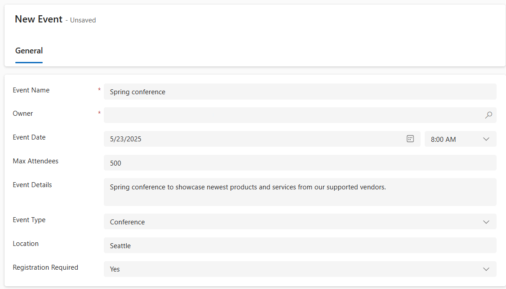

---
lab:
  title: 'Lab 4: Membuat aplikasi berbasis model'
  learning path: 'Learning Path: Demonstrate the capabilities of Microsoft Power Apps'
  module: 'Module 3: Build a model-driven app'
---
## Tujuan pembelajaran

Dalam latihan ini, pelajar akan membuat aplikasi berbasis model di Power Apps menggunakan Copilot. Anda akan menentukan model data, memodifikasi formulir dan tampilan, dan membuat aplikasi.

**Setelah berhasil menyelesaikan lab ini, Anda akan:**

-   Buat aplikasi berbasis model.
-   Ubah formulir dan tampilan dalam aplikasi agar paling sesuai dengan kebutuhan Anda.
-   Navigasikan melalui aplikasi berbasis model.

### Skenario

Contoso Consulting adalah organisasi layanan profesional yang berspesialisasi dalam layanan konsultasi IT dan AI. Sepanjang tahun, mereka menawarkan banyak acara yang berbeda kepada pelanggan mereka. Beberapa di antaranya adalah acara gaya pameran dagang di mana mereka memiliki banyak mitra masuk dan memberikan detail tentang produk baru, tren pasar, dan layanan. Yang lain terjadi sepanjang tahun dan merupakan webinar cepat yang digunakan untuk memberikan detail tentang masing-masing produk.

Contoso ingin menggunakan Power Platform untuk membangun solusi Manajemen Peristiwa yang dapat mereka gunakan untuk mengelola berbagai peristiwa yang mereka host sepanjang tahun.

Dalam latihan ini Anda akan membangun aplikasi berbasis model untuk mengelola peristiwa Contoso. Aplikasi berbasis model akan didasarkan pada model data yang ada dan akan mencakup Peristiwa, Sesi Peristiwa, dan pendaftaran Sesi.

### Detail Lab:

Sebelum memulai latihan ini, Disarankan agar selesai:

-   **Lab 1 – Membuat solusi**
-   **Lab 2 – Membuat model data**

Perkiraan waktu untuk menyelesaikan latihan ini adalah **20 hingga 30** menit.

## Tugas 1: Buat model data untuk mendukung aplikasi berbasis model baru Anda

Contoso saat ini menyimpan informasi kontak dalam instans Dataverse mereka, sehingga mereka ingin menggunakan Dataverse untuk melacak kursus dan pendaftaran kursus. Anda perlu membuat tabel yang diperlukan untuk mendukung aplikasi dan membangun aplikasi berbasis model berdasarkan model data tersebut.

1.  Jika perlu, buka browser web dan navigasikan ke [portal pembuat Power Apps](https://make.powerapps.com/) , dan masuk menggunakan kredensial akun Microsoft Anda.
1.  Menggunakan navigasi di sebelah kiri, pilih **Solusi.**
1.  **Buka solusi Manajemen** Peristiwa yang Anda buat sebelumnya.
1.  Pada bilah **Perintah** pilih **Aplikasi** berbasis Model Aplikasi \> **** Baru.** \> **
1.  Pilih bagian **Buat** .
    -   **Nama**: `Contoso Event Management`
    -   **Deskripsi:**` Used to manage Events and Event Sessions`.
1.  Pilih tombol **Buat**.
1.  Pilih tombol **+Tambahkan Halaman** , pilih **Tabel dataverse.**
1.  Pilih tabel berikut:
    -   Kontak
    -   Kejadian
    -   Sesi Acara
    -   Pendaftaran sesi
1.  Pastikan **Perlihatkan di navigasi** dipilih.

    

1. Pilih tombol **Tambahkan**.

> **Catatan:** Terkadang Anda akan diminta untuk masuk saat bekerja dengan perancang. Pilih X untuk membatalkan keluar dari layar masuk.

## Tugas 2: Edit aplikasi berbasis model agar sesuai dengan kebutuhan Anda

Sekarang setelah aplikasi dibuat, kita akan membuat beberapa perubahan pada cara aplikasi disajikan. Kami ingin memiliki dua kelompok yang berbeda; Orang dan Peristiwa. Kami ingin memiliki tabel Kontak di grup Orang, dan semua tabel Peristiwa di grup Acara.

1.  Di bawah **Navigasi** di sisi kiri layar, pilih **Grup** Baru.
1.  Di sisi kanan aplikasi, perluas **panel Properti** .
1.  **Ubah Judul** dari **Grup** Baru menjadi `People`.

    

1.  Pilih **Elipsis** pada **grup Orang** .
1.  Pilih **Grup** baru.
1.  Di panel **Properti** , ubah nama grup dari **Grup** Baru menjadi `Events`.
1.  Arahkan mouse ke atas **tampilan** Pendaftaran Sesi di sebelah kiri, pilih **elipsis**, dan pilih **Pindah ke bawah** untuk memindahkan **Pendaftaran** Sesi ke **dalam grup Peristiwa** .
1.  Arahkan mouse ke atas tampilan Sesi** Peristiwa di sebelah kiri, pilih **elipsis**, dan pilih **Pindah ke bawah** untuk memindahkan **Sesi** Peristiwa ke **dalam grup Peristiwa**.**
1.  Arahkan mouse ke atas **tampilan** Peristiwa di sebelah kiri, pilih **elipsis**, dan pilih **Pindahkan ke bawah** untuk memindahkan **Peristiwa** ke **dalam grup** Peristiwa.

    Aplikasi Anda harus menyerupai gambar:

    

## Tugas 3: Edit berbagai formulir dan tampilan di aplikasi berbasis model Anda

Aplikasi berbasis model menggunakan formulir dan tampilan untuk menyajikan data kepada pengguna di antarmuka Pengguna (UI). Kita akan membuat beberapa perubahan pada item tersebut.

1.  Jika perlu, pastikan aplikasi Contoso Event Management** Anda **terbuka di perancang.
1.  Di sisi kiri layar, di bawah **grup Orang** , arahkan kursor **ke formulir** Kontak dan pilih **Edit.**

    Jika Anda diminta untuk menyimpan perubahan, pilih **Simpan dan lanjutkan.**

1.  Di bawah **Kolom** Tabel di sebelah kiri, pilih **Kolom** tabel baru.
1.  Konfigurasikan kolom tabel sebagai berikut:
    -   **Nama tampilan**: `Contact Type`
    -   **Jenis Data:** Pilihan
    -   **Sinkronkan dengan pilihan global:** Tidak
1.  Atur **Label** pilihan pertama ke **Pembicara.**
1.  Pilih **+ Pilihan** Baru dan atur label ke **Peserta.**
1.  Pilih **+ Pilihan** Baru dan atur label ke **Staf** Dukungan.

    

1.  Pilih tombol **Simpan**.
1.  Menggunakan mouse Anda, pilih **teks Kontak** Baru untuk memilih header formulir. *(Persegi panjang ungu akan muncul di sekitar header)*
1. Di bawah **Kolom** Tabel, di **bidang Pencarian** , masukkan **Kontak**.
1. **Pilih kolom tabel Tipe** Kontak yang baru saja Anda buat.
1. **Tipe** Kontak sekarang akan muncul di **Header**.

    

1. Pada bilah Perintah formulir **, pilih tombol **Simpan dan terbitkan**.**
1. Pilih tombol Panah** belakang **untuk kembali ke perancang aplikasi berbasis model
1. Di bawah **Navigasi** di sebelah kiri, arahkan kursor **ke **tampilan** Kontak, dan pilih ikon Edit**. (Jika diminta untuk menyimpan, pilih **Simpan dan lanjutkan.**)
1. Pilih **+ Tampilkan Kolom**.
1. Cari dan tambahkan **kolom Tipe** Kontak ke tampilan.
1. Pilih tombol **Simpan dan Terbitkan** .
1. Pilih tombol Panah** belakang **untuk kembali ke desainer applicaton berbasis model.

    Selanjutnya, kita akan membuat perubahan yang diperlukan pada formulir yang tersisa.

1.  Di bawah **Navigasi**, pilih **Tampilan Peristiwa**
    
    Perhatikan bahwa mungkin **ada kolom EventDetails1** . Jika demikian, kita akan menghapusnya dari tampilan. *(Jika Anda tidak memilikinya, Anda dapat melompat ke **Tugas 4: Simpan dan Terbitkan**)*

1.  Arahkan mouse ke **atas tampilan** Peristiwa dan pilih tombol **Edit** .

    Jika diminta untuk **Menyimpan perubahan, pilih **Simpan dan lanjutkan****.

1.  Pada Tampilan **** pilih panah di samping **EventDetails1**, dan dari menu yang muncul, pilih **Hapus**.

    

1.  Pilih tombol **Simpan dan Terbitkan** .
1.  Pilih tombol Panah** belakang **untuk kembali ke perancang aplikasi.
1.  Di bawah **Navigasi**, arahkan mouse ke **atas formulir** Peristiwa **** dan pilih **Edit**.

    Jika diminta untuk menyimpan perubahan, pilih **Simpan dan lanjutkan**.

1.  Pilih **bidang Detail Peristiwa1** dan tekan tombol **Hapus** di keyboard Anda.

    Formulir Anda harus menyerupai gambar:

    

    Jika tidak cocok persis, itu baik-baik saja selama semua bidang dalam gambar ada di sana.  

1.  Pilih tombol **Simpan dan terbitkan** .
1.  Pilih tombol Panah** belakang **untuk kembali ke perancang aplikasi.

## Tugas 4: Simpan dan Terbitkan (Jika Anda tidak memiliki bidang EventDetail1 pada formulir Anda, lanjutkan di sini.)

1.  Pada bilah **Perintah** aplikasi, pilih tombol **Simpan dan Terbitkan** .

1.  Pilih tombol **Kembali** untuk kembali ke **solusi Manajemen** Peristiwa.
1.  Pilih **Kembali ke panah solusi** untuk kembali ke portal pembuat Power Apps** utama**.
1.  Pilih panah **Kembali** untuk kembali ke layar Utama **Power Apps** .

## Tugas 5: Uji aplikasi baru Anda

Sekarang setelah aplikasi berbasis model Anda dibuat, kami akan menguji fungsionalitasnya.

Pertama kita akan menambahkan beberapa kontak.

1.  Menggunakan navigasi di sebelah kiri, pilih **Aplikasi**.
1.  Ubah aplikasi yang ditampilkan dari **Aplikasi** saya ke **Semua**.
1.  Arahkan mouse ke **atas aplikasi Contoso Event Management** yang baru saja Anda buat dan pilih **ikon Putar** .
1.  Menggunakan navigasi di sebelah kiri, pilih **Kontak**.
1.  Pada bilah **Perintah** , pilih tombol **+ Baru** .
1.  **Di layar Kontak** Baru, konfigurasikan sebagai berikut:
    -   **Nama Depan:** `Suzanne`
    -   **Nama Belakang:** `Diaz`
    -   **Jabatan Pekerjaan:** `Engineer`
1.  Di header formulir, pilih panah bawah di samping **Tipe** Kontak.
1.  Atur **Jenis** Kontak ke **Pembicara**.

    

1.  Pilih tombol **Simpan** untuk menyimpan kontak dan membiarkannya terbuka.
1. Pilih tombol **+ Baru**.
1. **Di layar Kontak** Baru, konfigurasikan sebagai berikut:
    -   **Nama Depan:** Edgar
    -   **Nama Belakang:** Swenson
    -   **Jabatan Pekerjaan:** Arsitek
    -   **Email:** Masukkan alamat email Anda (Pastikan Anda menambahkan **alamat email Anda** .)
1. Di header formulir, pilih panah bawah di samping **Tipe** Kontak.
1. Atur **Tipe** Kontak ke **Peserta**.
1. Pilih tombol **Simpan & Tutup** .

    Selanjutnya, kita akan menambahkan peristiwa baru.

1.  Menggunakan navigasi di sebelah kiri, pilih **Peristiwa**.
1.  Pada bilah perintah, pilih tombol **+ Baru** .
1.  **Di layar Kejadian** Baru, konfigurasikan sebagai berikut:
    - **Nama Peristiwa:** `Spring conference`.
    - **Tanggal Acara:** Tanggal besok.
    - **Peserta Maks:** `500`
    - **Detail Peristiwa:** `Spring conference to showcase newest products and services from our supported vendors`.
    - **Jenis Acara:** Konferensi
    - **Lokasi**: `Seattle`
    - **Pendaftaran Diperlukan:** Ya/Benar

    

1.  Pilih tombol **Simpan & Tutup** .

    Selanjutnya, kita akan menambahkan sesi baru untuk Acara.

1.  Menggunakan navigasi di sebelah kiri, pilih **Sesi** Peristiwa.
1.  Pilih tombol **+ Baru**.
1.  Konfigurasikan **Sesi** Peristiwa sebagai berikut:
    - **Nama Sesi:** `Responsible AI`
    - **Tanggal Sesi:** Tanggal Besok
    - **Durasi:** 1,5 Jam
    - **Deskripsi Sesi:** `With all the new AI solutions, being responsible is important. We will discuss the challenges`.
    - **Pembicara:** `Suzanne Diaz`
    - **Peristiwa:** `Spring Conference`

    

1.  Pilih tombol **Simpan dan tutup** .

    Akhirnya, kita akan membuat **Pendaftaran** Sesi.

1.  Menggunakan navigasi di sebelah kiri, pilih **Pendaftaran Sesi.**
1.  Pada bilah **Perintah**, pilih **+ Baru**.
1.  Selesaikan pendaftaran sesi sebagai berikut:
    - **Nama Pendaftaran:** `E, Swenson Registration`.
    - **Pemilik:** Biarkan apa adanya
    - **Tanggal Pendaftaran:** Tanggal Hari Ini
    - **Instruksi Khusus:** `No Gluten`
    - **Peserta:** `Edgar Swenson`
    - **Sesi Acara:** `Responsible AI`

    

1.  Pilih tombol Simpan dan Tutup **** .

