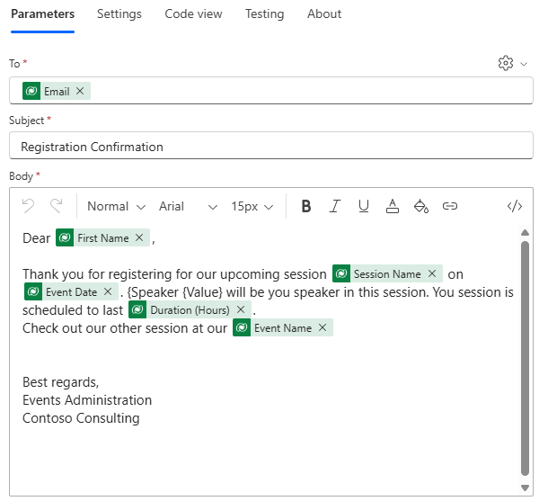

---
lab:
  title: 'Lab 6: Membuat alur Power Automate'
  learning path: 'Learning Path: Demonstrate the capabilities of Microsoft Power Automate'
  module: 'Module 2: Build a Microsoft Power Automate flow'
---
## Tujuan pembelajaran

Dalam latihan ini, pelajar akan membuat serangkaian alur cloud yang berbeda menggunakan Microsoft Copilot di Power Automate. Anda akan menggunakan metode pembuatan yang berbeda seperti Copilot dan dari awal agar terbiasa dengan berbagai opsi yang tersedia.

**Setelah berhasil menyelesaikan latihan ini, Anda akan:**

- Menggunakan perintah bahasa alami untuk merancang alur kerja
- Mengonfigurasi pemicu dan tindakan
- Uji otomatisasi untuk penggunaan praktis.

### Skenario

Contoso Consulting adalah organisasi layanan profesional yang berspesialisasi dalam layanan konsultasi IT dan AI. Sepanjang tahun, mereka menawarkan banyak acara yang berbeda kepada pelanggan mereka. Beberapa di antaranya adalah acara gaya pameran dagang di mana mereka memiliki banyak mitra masuk dan memberikan detail tentang produk baru, tren pasar, dan layanan. Yang lain terjadi sepanjang tahun dan merupakan webinar cepat yang digunakan untuk memberikan detail tentang masing-masing produk. Selain itu, Contoso mulai menggunakan Agen otomatis untuk membantu pelanggan dengan pertanyaan.

Contoso ingin menggunakan Power Automate untuk membangun alur konfirmasi pendaftaran yang akan mengirim email otomatis ke pelanggan saat mereka mendaftar untuk suatu acara. Selain itu, mereka ingin membuat Alur yang akan menggunakan AI untuk memberikan jawaban generatif atas pertanyaan pelanggan.

Dalam latihan ini Anda akan membangun serangkaian alur Power Automate berdasarkan kriteria tertentu.

Sebelum memulai latihan ini, anda harus menyelesaikan lab berikut:

- **Lab 3 – Membuat model data**
- **Lab 5 – Membangun aplikasi berbasis model**

## Latihan 1: Membuat alur pemberitahuan Pendaftaran Sesi

Dalam latihan pertama ini, Anda akan membangun alur yang akan berjalan secara otomatis ketika Pendaftaran Sesi baru dibuat. Ini akan mendapatkan detail sesi, acara, dan kontak siapa yang mendaftar dan mengirim email ke ini dengan detail pendaftaran mereka.

### Tugas 1: Membuat alur

Kami ingin mengirim konfirmasi pendaftaran kepada pengguna yang baru terdaftar. Kami akan membuat alur yang akan mengambil detail pendaftaran dan mengirim email konfirmasi ke pengguna terdaftar.

1.  Buka <https://make.powerautomate.com>.
2.  Anda mungkin perlu mengautentikasi ulang, pilih **Masuk** dan ikuti instruksi, jika diperlukan.
3.  Di layar Buat otomatisasi Anda dengan Salinan, masukkan: *"Saat Pendaftaran Sesi baru dibuat di Dataverse, dapatkan detail sesi dan peristiwa pendaftaran adalah untuk mengirim email konfirmasi ke orang yang terdaftar."*
4.  Copilot akan menyarankan alur potensial berdasarkan deskripsi Anda.
5.  Peta ini seharusnya terlihat seperti gambar di bawah ini:

6.  Pilih **Simpan dan lanjutkan**.
7.  Tinjau koneksi untuk memastikan semuanya benar.
8.  Pilih Buat alur.
9.  Pilih pemicu **Saat baris ditambahkan, dimodifikasi, atau dihapus**.
10. Isi kondisi pemicu untuk alur:
    - Pilih **Ditambahkan** untuk **Ubah jenis**
    - Pilih **Pendaftaran** Sesi untuk **nama Tabel**
    - Pilih **Organisasi** untuk **Cakupan**
11. Pilih teks **Saat baris ditambahkan, dimodifikasi, atau dihapus** dan ganti nama langkah **pemicu Saat Laporan Pengeluaran ditambahkan.**

Ini adalah praktik yang baik, sehingga Anda dan editor alur lainnya dapat memahami tujuan langkah tanpa harus menyelami detailnya.

### Tugas 2: Buat langkah untuk mendapatkan detail Sesi Peristiwa tempat Pendaftaran.

1.  Pilih **Dapatkan baris menurut langkah ID** .
2.  Pilih **Sesi** Peristiwa sebagai **Nama tabel**
3.  Pilih bidang **ID Baris**. Perhatikan bahwa jendela muncul untuk memilih **Konten dinamis** atau **Ekspresi**.
4.  **Di bidang ID** Baris, pilih **Sesi Peristiwa (Nilai)** dari **daftar Konten** dinamis.
5.  **Pilih teks Dapatkan baris menurut ID**, dan ganti nama tindakan **ini Dapatkan** **Sesi** Peristiwa.

Selanjutnya, kita akan mendapatkan detail Acara tempat sesi berada.

6.  Pilih **Dapatkan baris menurut LANGKAH ID 2** .
7.  Pilih **Peristiwa** sebagai **Nama tabel**
8.  Pilih bidang **ID Baris**. Perhatikan bahwa jendela muncul untuk memilih **Konten dinamis** atau **Ekspresi**.
9.  **Di bidang ID** Baris, pilih **Peristiwa (Nilai)** dari daftar Konten** dinamis**.
10.  **Pilih teks Dapatkan baris menurut ID**, dan ganti nama tindakan **ini Dapatkan** **Peristiwa**.

Terakhir, kita akan mendapatkan detail orang yang terdaftar untuk sesi tersebut.

11.  Di bawah Dapatkan Detail Peristiwa, atur pilih **Sisipkan Tindakan** baru.
12.  Di bidang pencarian masukkan Dataverse.
13.  Pilih **Dapatkan baris menurut ID**.
14.  Pilih **Kontak** sebagai **Nama tabel**
15.  Pilih bidang **ID Baris**. Perhatikan bahwa jendela muncul untuk memilih **Konten dinamis** atau **Ekspresi**.
16.  **Di bidang ID** Baris, pilih **Peserta (Nilai)** dari **daftar Konten** dinamis.
17.  **Pilih teks Dapatkan baris menurut ID**, dan ganti nama tindakan **ini Dapatkan** **Detail** Peserta.

### Tugas 3: Buat langkah untuk mengirim email untuk mengonfirmasi pendaftaran sesi

1.  **Pilih langkah** Kirim email.
2.  **Pilih ikon Gigi** di atas **bidang Kepada** dan pilih **Gunakan** **Nilai** Dinamis.
3.  **Pilih bidang Kepada** dan menggunakan nilai Dinamis, pilih **Email** di **bawah Dapatkan Detail** Peserta.
4.  Di bidang **Subjek** , pastikan tertulis Konfirmasi Pendaftaran.
5.  Masukkan teks berikut di **Isi Email**:

> [!NOTE]
> Konten dinamis perlu ditempatkan di tempat bidang diberi nama dalam tanda kurung. Disarankan untuk menyalin & menempel semua teks terlebih dahulu dan kemudian menambahkan konten dinamis di tempat yang benar.

*{Nama Depan} yang terhormat, Terima kasih telah mendaftar untuk sesi {Session Name} kami yang akan datang pada {Event Date}. Pembicara {Value} akan menjadi pembicara Anda dalam sesi ini. Sesi Anda dijadwalkan untuk {Duration (Jam) terakhir}. Lihat sesi kami yang lain di {Event Name} kami.*

*Salam hormat*

*Administrasi Peristiwa*

*Konsultasi Contoso*

6.  Sorot teks **{First Name}**. Ganti dengan **bidang Nama** Depan dari **langkah Dapatkan Detail** Peserta.
7.  **Sorot teks {Nama Sesi}**. Ganti dengan **bidang Nama** Sesi dari **langkah Dapatkan Sesi** Peristiwa.
8.  **Sorot teks {Event Date}**. Ganti dengan **bidang Tanggal** Peristiwa dari **langkah Dapatkan Detail** Peristiwa.
9.  **Sorot teks {Duration (Jam)}**. Ganti dengan **bidang Durasi (Jam)** dari **langkah Dapatkan Sesi** Peristiwa.
10.  **Sorot teks {Nama Peristiwa}**. Ganti dengan **bidang Nama** Peristiwa dari **langkah Dapatkan Detail** Peristiwa.

Langkah Anda yang telah selesai harus menyerupai gambar:

11.  Pilih **Simpan**.

Biarkan tab alur ini terbuka untuk tugas berikutnya. Alur Anda akan terlihat seperti berikut:

### Tugas 4: Memvalidasi dan menguji alur

1.  Buka tab baru di browser Anda dan navigasikan ke https://make.powerapps.com.
2.  Pilih lingkungan **Dev One** di kanan atas jika belum dipilih.
3.  Pilih **Aplikasi** dan buka **Aplikasi** Manajemen Peristiwa Contoso.
4.  Dengan membiarkan tab browser ini terbuka, navigasikan kembali ke tab sebelumnya dengan alur Anda.
5.  Pada bilah perintah, pilih **Uji**. Pilih **Secara Manual** lalu pilih **Uji**.
6.  Navigasikan ke tab browser dengan aplikasi berbasis model Anda terbuka.
7.  Menggunakan navigasi peta situs di sebelah kiri, pilih **Pendaftaran** Sesi.
8.  Pilih tombol **+ Baru** untuk menambahkan catatan Pendaftaran** Sesi baru**.
9.  Lengkapi **catatan** Pendaftaran Sesi sebagai berikut:
    -   **Nama Laporan:** Laporan Pengujian
    -   **Tujuan Laporan:** Konferensi
    -   **Tanggal jatuh tempo laporan:** Besok
10. Pilih tombol **Simpan & Tutup** .
11. Navigasikan ke tab browser tempat pengujian Alur Anda berjalan. Setelah penundaan singkat, Anda akan melihat alur berjalan. Di sinilah Anda dapat menangkap masalah apa pun dalam alur atau mengonfirmasi bahwa alur berhasil dijalankan.

Setelah penundaan singkat, Anda akan melihat email di kotak masuk Anda.

> [!NOTE]
> Ini mungkin masuk ke folder email Sampah Anda.

## Latihan 2: Membuat alur pemecahan masalah teknologi

### Tugas 1: Membuat alur pemecahan masalah teknologi

Dalam latihan ini, Anda akan membuat alur Power Automate yang akan dijalankan membentuk Agen yang akan menangkap gejala dan menggunakannya untuk mendiagnosis masalah teknologi.

1.  Buka [Power Automate**](https://make.powerautomate.com)**.****
2.  Menggunakan navigasi di sebelah kiri, pilih **Buat**.
3.  Pilih **Alur cloud otomatis.**
4.  Pilih tombol **Lewati** .
5.  Pilih kotak **Tambahkan pemicu** . Cari dan pilih **Saat agen memanggil alur**.
6.  Pilih **Tambahkan Input**.
7.  Pilih **Teks** dan ubah nama dari **Input** ke **Jenis** Perangkat.
8.  Pilih **Tambahkan Input** lagi, pilih **Teks**, dan ubah nama dari **Input** ke **Jenis** Masalah.
9.  Pilih **Tambahkan Input** untuk terakhir kalinya, pilih **Teks**, dan ubah nama dari **Input** ke **Deskripsi Masalah.**

Pemicu Anda yang telah selesai harus menyerupai gambar berikut:

> [!IMPORTANT]
> Jika kami membuat pemeriksa gejala sejati teknologi, kami akan menangkap beberapa input yang berbeda untuk membantu jawaban yang dihasilkan seakurat mungkin. Untuk latihan ini, kami hanya menunjukkan bagaimana Anda akan melakukannya.

#### Tentukan tindakan

1.  Di bawah saat **agen memanggil pemicu alur** , pilih **Sisipkan langkah** baru (+).
2.  Di jendela tambahkan tindakan, cari, dan pilih **Jalankan perintah**.
3.  Di jendela **Jalankan perintah** , atur **bidang Prompt** ke **Ringkasan** AI.
4.  **Di bidang Teks** Input, pilih **ikon Nilai** *Dynamics (Lightning bolt).*
5.  Di bawah Saat agen memanggil alur, pilih nilai dinamis berikut:
    -   Jenis Perangkat
    -   Tipe Masalah
    -   Deskripsi Masalah
6.  **Di bawah langkah Jalankan Perintah**, pilih **Sisipkan langkah baru (+)**
7.  Di jendela **Tambahkan tindakan** , masukkan "Respons", dan pilih **Tanggapi agen**.
8.  Pilih **Tambahkan output**.
9.  Pilih **Teks**.
10. Atur nama output ke **Teks** Ringkasan.
11. Di bidang **Masukkan nilai untuk merespons,** pilih **Nilai** dinamis (Lighting bolt)
12. Cari dan pilih **Isi**.

Langkah Anda yang telah selesai **Merespons agen** , harus menyerupai berikut ini:

13.  Pilih **Simpan**.
14.  Pilih tombol **Uji**.
15.  Di panel Alur** pengujian**, pilih **Secara** Manual.
16.  Pilih tombol **Uji**.
17.  Di panel Jalankan Alur, Masukkan yang berikut ini:
    - **Jenis Perangkat:** PC Windows
    - **Jenis Masalah:** Aplikasi Tidak Responsif
    - **Deskripsi Masalah:** Saat Meluncurkan Microsoft Excel, aplikasi akan mulai dimuat tetapi akan membeku tepat setelah layar Splash Excel. Itu hanya duduk di sana dan tidak ada yang terjadi.
18.  Pilih tombol **Jalankan alur** .
19.  Setelah pengujian selesai, pilih langkah Jalankan Perintah. Perhatikan bahwa Beralih kembali ke tab Perancang****.
20.  Pilih **Terbitkan**.
