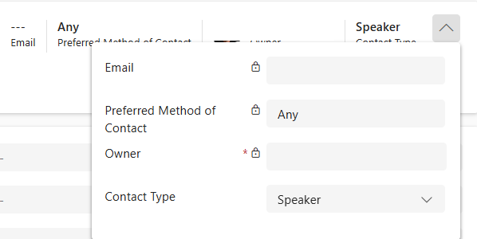

---
lab:
  title: 'Lab 6: Membuat alur Power Automate'
  learning path: 'Learning Path: Demonstrate the capabilities of Microsoft Power Automate'
  module: 'Module 2: Build a Microsoft Power Automate flow'
---

## Tujuan pembelajaran

Dalam latihan ini, pelajar akan membuat serangkaian alur cloud yang berbeda menggunakan Microsoft Copilot di Power Automate. Anda akan menggunakan metode pembuatan yang berbeda seperti Copilot dan dari awal agar terbiasa dengan berbagai opsi yang tersedia.

Setelah berhasil menyelesaikan latihan ini, Anda akan:

- Menggunakan perintah bahasa alami untuk merancang alur kerja
- Mengonfigurasi pemicu dan tindakan
- Uji otomatisasi untuk penggunaan praktis.

### Skenario

Contoso Consulting adalah organisasi layanan profesional yang berspesialisasi dalam layanan konsultasi IT dan AI. Sepanjang tahun, mereka menawarkan banyak acara yang berbeda kepada pelanggan mereka. Beberapa di antaranya adalah acara gaya pameran dagang di mana mereka memiliki banyak mitra masuk dan memberikan detail tentang produk baru, tren pasar, dan layanan. Yang lain terjadi sepanjang tahun dan merupakan webinar cepat yang digunakan untuk memberikan detail tentang masing-masing produk. Selain itu, Contoso mulai menggunakan Agen otomatis untuk membantu pelanggan dengan pertanyaan.

Contoso ingin menggunakan Power Automate untuk membangun alur konfirmasi pendaftaran yang akan mengirim email otomatis ke pelanggan saat mereka mendaftar untuk suatu acara. 

Dalam latihan ini Anda akan membangun serangkaian alur Power Automate berdasarkan kriteria tertentu.

Sebelum memulai latihan ini, Anda harus telah menyelesaikan lab berikut:

- **Lab 2 – Membuat model data**
- **Lab 5 – Membangun aplikasi berbasis model**

## Latihan 1: Membuat alur pemberitahuan Pendaftaran Sesi

Dalam latihan pertama ini, Anda akan membangun alur yang akan berjalan secara otomatis ketika Pendaftaran Sesi baru dibuat. Ini akan mendapatkan detail sesi, acara, dan kontak siapa yang mendaftar dan mengirim email ke ini dengan detail pendaftaran mereka.

### Tugas 1: Membuat alur

Kami ingin mengirim konfirmasi pendaftaran kepada pengguna yang baru terdaftar. Kami akan membuat alur yang akan mengambil detail pendaftaran dan mengirim email konfirmasi ke pengguna terdaftar.

1. Buka [https://make.powerautomate.com](https://make.powerautomate.com/).

2. Anda mungkin perlu mengautentikasi ulang, pilih **Masuk** dan ikuti instruksi, jika diperlukan.

3. Pilih lingkungan **Dev One** di kanan atas jika belum dipilih. (Penting, lupakan untuk melakukan langkah ini).

4. Di navigasi kiri, pilih **Buat**. (Jika diminta, pilih **Memulai**.)

5. Pilih **+ Alur baru** dan pilih **Alur cloud otomatis**.

6. Masukkan **Pemberitahuan** Pendaftaran untuk **Nama** alur.

7. Di **Pilih pemicu alur Anda**, cari **Dataverse**.

8. Pilih pemicu **Saat baris ditambahkan, dimodifikasi, atau dihapus**, lalu pilih **Buat**.

    Jika Anda melihat kesalahan Parameter** Tidak **Valid, ini karena Anda belum mengautentikasi. Ikuti langkah-langkah di bawah ini untuk membuat koneksi. 
    - Pilih **Ubah Koneksi**.
    - Pilih **Tambahkan Baru.*
    - **Di bidang Nama** Koneksi, masukkan Administrator** MOD**. Biarkan Jenis** autentikasi sebagai **OAuth**, dan **Pilih Masuk**.**
    - Setelah masuk, pindah ke **Langkah 9.** 

9. Isi kondisi pemicu untuk alur:

    - Pilih **Ditambahkan** untuk **Ubah jenis**
    - Pilih **Pendaftaran** Sesi untuk **Nama tabel.**
    - Pilih **Organisasi** untuk **Cakupan** Pada langkah pemicu, pilih elipsis (**...**) dan pilih **Ganti Nama**. 

10. Ganti nama langkah **pemicu Saat Pendaftaran Sesi ditambahkan.**

Ini adalah praktik yang baik, sehingga Anda dan editor alur lainnya dapat memahami tujuan langkah tanpa harus menyelami detailnya.

### Tugas 2: Buat langkah untuk mendapatkan detail Sesi Peristiwa tempat Pendaftaran.

1. Pilih **+ Langkah baru**. 

2. Cari **Dapatkan baris menurut ID**. 

3. Pilih tindakan **Dapatkan baris berdasarkan ID**.

4. Pilih **Sesi** Peristiwa sebagai **Nama tabel**

5. Pilih bidang **ID Baris**. Perhatikan bahwa ikon muncul untuk memilih **Konten** atau **Ekspresi** dinamis.

6. **Di bidang ID** Baris, pilih **Sesi Peristiwa (Nilai)** dari **daftar Konten** dinamis. Dalam langkah ini, Anda mencari **Sesi** Peristiwa untuk **Pendaftaran** Sesi yang dibuat untuk memicu alur ini.

7. Pada tindakan **Dapatkan baris berdasarkan ID**, pilih elipsis (**...**) dan pilih **Ganti Nama**. Ganti nama tindakan **ini Dapatkan Sesi Peristiwa**

Selanjutnya, kita akan mendapatkan detail Acara tempat sesi berada.

8. **Di bawah langkah Dapatkan Sesi** Peristiwa, pilih **+ Sisipkan Tindakan.**

9. Cari **Dapatkan baris menurut ID**. 

10. Pilih tindakan **Dapatkan baris berdasarkan ID**.

11. Pilih **Peristiwa** sebagai **Nama tabel**

12. Pilih bidang **ID Baris**. Perhatikan bahwa ikon muncul untuk memilih **Konten** atau **Ekspresi** dinamis.

13. **Di bidang ID** Baris, pilih **Peristiwa (Nilai)** dari daftar Konten** dinamis**. Dalam langkah ini, Anda mencari **Peristiwa** untuk **Sesi** Peristiwa yang diambil di langkah sebelumnya.

14. Pada tindakan **Dapatkan baris berdasarkan ID**, pilih elipsis (**...**) dan pilih **Ganti Nama**. Ganti nama tindakan **ini Dapatkan Peristiwa.**

Terakhir, kita akan mendapatkan detail orang yang terdaftar untuk sesi tersebut.

15. Di bawah Dapatkan Detail Peristiwa, atur pilih **Sisipkan Tindakan** baru.

16. Di bidang pencarian masukkan **Dapatkan baris menurut ID**.

17. Pilih **Dapatkan baris menurut ID**.

18. Pilih **Kontak** sebagai **Nama tabel**

19. Pilih bidang **ID Baris**. Perhatikan bahwa jendela muncul untuk memilih **Konten dinamis** atau **Ekspresi**.

20. **Di bidang ID** Baris, pilih **bidang Peserta (Nilai)** dari pemicu **Saat pendaftaran sesi ditambahkan** dari **daftar Konten dinamis**.

21. **Pilih teks Dapatkan baris menurut ID**, dan ganti nama tindakan **ini Dapatkan** **Detail** Peserta.

### Tugas 3: Buat langkah untuk mengirim email untuk mengonfirmasi pendaftaran sesi

1. **Di bawah langkah Dapatkan Detail** Peserta, pilih **Sisipkan Tindakan** baru.

2. Di bidang pencarian masukkan **Kirim email**.

3. Pilih **Kirim email (V2)**.

Anda mungkin diminta untuk membuat koneksi ke outlook, jika demikian pilih tombol **Masuk** , dan masuk dengan **akun Administrator** Mod. 

4. Tepat di atas **bidang Kepada** , pilih **ikon Gigi** . Dari menu yang muncul, pilih **Gunakan Konten dinamis**.

 

5. Menggunakan Nilai dinamis, di **bidang Kepada** , pilih **Email** di **bawah Dapatkan Detail** Peserta.

6. Di bidang **Subjek** , pastikan tertulis Konfirmasi Pendaftaran.

7. Masukkan teks berikut di **Isi Email**:

> **Catatan:** Konten dinamis perlu ditempatkan di mana bidang dinamai dalam tanda kurung siku. Disarankan untuk menyalin & menempel semua teks terlebih dahulu dan kemudian menambahkan konten dinamis di tempat yang benar.

  *{Nama Depan} yang terhormat, Terima kasih telah mendaftar untuk sesi {Session Name} kami yang akan datang pada {Event Date}. {Speaker} akan menjadi pembicara Anda dalam sesi ini. Sesi Anda dijadwalkan untuk {Duration (Jam) terakhir}. Lihat sesi kami yang lain di {Event Name} kami.*

  *Salam hormat*

  *Administrasi Peristiwa*
  
  *Konsultasi Contoso*

Selanjutnya, kita akan mengganti teks dalam tanda kurung dengan item yang diuraikan di bawah ini.

8. Sorot teks **{First Name}**. Ganti dengan **bidang Nama** Depan dari **langkah Dapatkan Detail** Peserta.

9. **Sorot teks {Nama Sesi}**. Ganti dengan **bidang Nama** Sesi dari **langkah Dapatkan Sesi** Peristiwa.

10. **Sorot teks {Event Date}**. Ganti dengan **bidang Tanggal** Peristiwa dari **langkah Dapatkan Detail** Peristiwa.

11. **Sorot teks {Speaker}**. Ganti dengan **bidang Pembicara (Nilai)** dari **langkah Dapatkan Sesi** Peristiwa.

12. **Sorot teks {Duration (Jam)}**. Ganti dengan **bidang Durasi (Jam)** dari **langkah Dapatkan Sesi** Peristiwa.

13. **Sorot teks {Nama Peristiwa}**. Ganti dengan **bidang Nama** Peristiwa dari **langkah Dapatkan Detail** Peristiwa.

Langkah Anda yang telah selesai harus menyerupai gambar:

14. Pilih **Simpan**.

Biarkan tab alur ini terbuka untuk tugas berikutnya. Alur Anda akan terlihat seperti berikut:

### Tugas 4: Masukkan beberapa data sampel

> **Catatan:** Jika Anda menyelesaikan Lab 5 – Membangun aplikasi berbasis model, Anda dapat melewati tugas ini dan berpindah langsung ke Tugas 5. 

1. Menggunakan navigasi di sebelah kiri, pilih **Aplikasi**.

2. Ubah aplikasi yang ditampilkan dari **Aplikasi** saya ke **Semua**.

3. Arahkan mouse ke **aplikasi Manajemen** Peristiwa dan pilih **ikon Putar** .

4. Menggunakan navigasi di sebelah kiri, pilih **Kontak**.

5. Pada bilah perintah, pilih tombol **+ Baru** .

6. **Di layar Kontak** Baru, konfigurasikan sebagai berikut:

    - **Nama Depan:** Suzanne

    - **Nama Belakang:** Diaz

    - **Jabatan Pekerjaan:** Insinyur

7. Di header formulir, pilih panah bawah di samping **Tipe** Kontak.

8. Atur **Jenis** Kontak ke **Pembicara**.

9. Pilih tombol **Simpan** untuk menyimpan kontak dan membiarkannya terbuka.

10. Pilih tombol **+ Baru**.

11. **Di layar Kontak** Baru, konfigurasikan sebagai berikut:

    - **Nama Depan:** Edgar

    - **Nama Belakang:** Swenson

    - **Jabatan Pekerjaan:** Arsitek

    - **Email:** Masukkan alamat email Anda (PENTING atau alur Anda tidak akan berjalan)

12. Di header formulir, pilih panah bawah di samping **Tipe** Kontak.

13. Atur **Tipe** Kontak ke **Peserta**.

14. Pilih tombol **Simpan &amp; Tutup**.

Selanjutnya, kita akan menambahkan peristiwa baru.

15. Menggunakan navigasi di sebelah kiri, pilih **Peristiwa**.

16. Pada bilah perintah, pilih tombol **+ Baru** .

17. **Di layar Kejadian** Baru, konfigurasikan sebagai berikut:

    - **Nama Acara:** Konferensi musim semi.

    - **Tanggal Acara:** Tanggal besok.

    - **Peserta Maks:** 500

    - **Detail Acara:** Konferensi musim semi untuk menampilkan produk dan layanan terbaru dari vendor kami yang didukung.

    - **Jenis Acara:** Konferensi

    - **Lokasi:** Seattle

    - **Pendaftaran Diperlukan:** Ya/Benar

18. Pilih tombol **Simpan &amp; Tutup**.

Selanjutnya, kita akan menambahkan sesi baru untuk Acara.

19. Menggunakan navigasi di sebelah kiri, pilih **Sesi** Peristiwa.

20. Pilih tombol **+ Baru**.

21. Konfigurasikan **Sesi** Peristiwa sebagai berikut:

    - **Nama Sesi:** AI yang bertanggung jawab

    - **Tanggal Sesi:** Tanggal Besok

    - **Durasi:** 1,5 Jam

    - **Deskripsi Sesi:** Dengan semua solusi AI baru, menjadi bertanggung jawab adalah penting. Kita akan membahas tantangannya.

    - **Pembicara:** Suzanne Diaz

    - **Acara:** Konferensi Musim Semi

22. Pilih tombol **Simpan dan tutup** .

 
### Tugas 5: Memvalidasi dan menguji alur

1. Jika perlu, buka tab baru di browser Anda dan navigasi ke [https://make.powerapps.com](https://make.powerapps.com/). 

2. Pilih lingkungan **Dev One** di kanan atas jika belum dipilih.

3. Pilih **Aplikasi** dan buka **Aplikasi** Manajemen Peristiwa Contoso.

4. Dengan membiarkan tab browser ini terbuka, navigasikan kembali ke tab sebelumnya dengan alur Anda.

5. Pada bilah perintah, pilih **Uji**. Pilih **Secara Manual** lalu pilih **Uji**.

6. Navigasikan ke tab browser dengan aplikasi berbasis model Anda terbuka.

Akhirnya, kita akan membuat **Pendaftaran** Sesi.

7. Menggunakan navigasi di sebelah kiri, pilih **Pendaftaran Sesi.**

8. Pada bilah **Perintah**, pilih **+ Baru**.

9. Selesaikan pendaftaran sesi sebagai berikut:

    - **Nama:** E, Pendaftaran Swenson.

    - **Tanggal Pendaftaran:** Tanggal Hari Ini

    - **Peserta:** Edgar Swenson

    - **Sesi:** AI yang bertanggung jawab

10. Pilih tombol Simpan dan Tutup **** .

11. Pilih tombol **Simpan &amp; Tutup**.

12. Navigasikan ke tab browser tempat pengujian Alur Anda berjalan. Setelah penundaan singkat, Anda akan melihat alur berjalan. Di sinilah Anda dapat menangkap masalah apa pun dalam alur atau mengonfirmasi bahwa alur berhasil dijalankan.

Setelah penundaan singkat, Anda akan melihat email di kotak masuk Anda.

> **Catatan:** Ini mungkin masuk ke folder email Sampah Anda.
