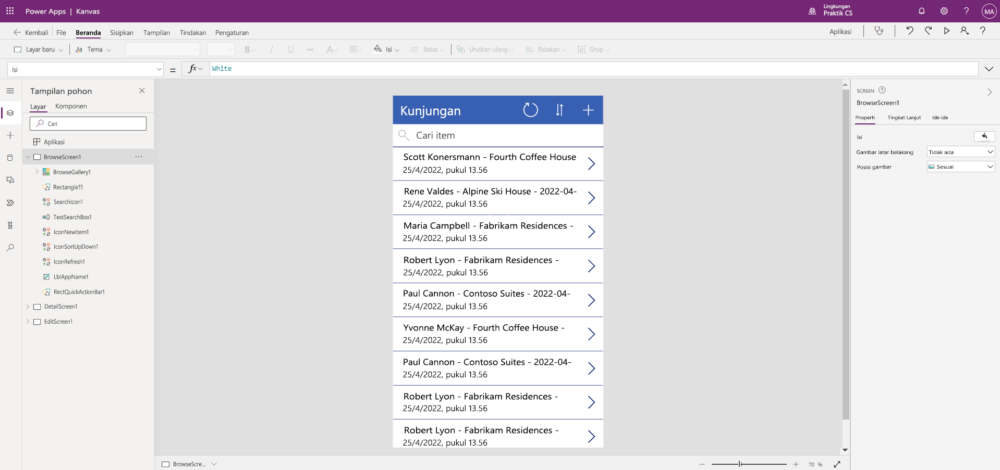

---
lab:
  title: 'Lab 2: Cara membuat aplikasi kanvas'
  module: 'Module 3: Get started with Power Apps'
---

# Lab 2: Cara membuat aplikasi kanvas

**Penyewa WWL - Ketentuan Penggunaan** Jika Anda diberikan penyewa sebagai bagian dari pengiriman pelatihan yang dipimpin instruktur, harap dicatat bahwa penyewa tersedia untuk tujuan mendukung lab langsung dalam pelatihan yang dipimpin instruktur. Penyewa tidak boleh dibagikan atau digunakan untuk tujuan di luar lab langsung. Penyewa yang digunakan dalam kursus ini adalah penyewa uji coba dan tidak dapat digunakan atau diakses setelah kelas berakhir dan tidak memenuhi syarat untuk ekstensi. Penyewa tidak boleh dikonversi ke langganan berbayar. Penyewa yang diperoleh sebagai bagian dari kursus ini tetap menjadi milik Microsoft Corporation dan kami berhak untuk mendapatkan akses dan repositori kapan saja. 

## Skenario

Bellows College adalah organisasi pendidikan dengan beberapa gedung di kampus. Kunjungan kampus saat ini dicatat dalam jurnal kertas. Informasi tidak diambil secara konsisten, dan tidak ada sarana untuk mengumpulkan dan menganalisis data tentang kunjungan di seluruh kampus.

Saat ini, administrasi kampus memanfaatkan spreadsheet Excel untuk melacak pendaftaran pengunjung. Mereka ingin memodernisasi sistem pendaftaran pengunjung tempat akses ke gedung dikontrol oleh staf keamanan dan semua kunjungan harus didaftarkan sebelumnya dan dicatat oleh tuan rumah mereka.

Sepanjang kursus ini, Anda akan membangun aplikasi dan melakukan otomatisasi untuk memungkinkan administrasi dan personel keamanan Bellows College mengelola dan mengontrol akses ke gedung-gedung di kampus.

## Langkah-langkah lab tingkat tinggi

Kami akan mengikuti garis besar di bawah ini untuk mendesain aplikasi kanvas:

- Membuat aplikasi kanvas dari data di tabel Kunjungan

- Mengonfigurasi cara kunjungan ditampilkan di layar penelusuran

- Membuat beberapa perubahan mendasar pada aplikasi

- Menguji fungsionalitas aplikasi

## Prasyarat

- Penyelesaian **Modul 0 Lab 0 - Memvalidasi lingkungan lab**
- Menyelesaikan **Modul 2 Lab 1 - Membuat Model Data**

## Latihan 1: Membuat aplikasi bagi Visits Canvas

**Tujuan:** Dalam latihan ini, Anda akan membuat aplikasi kanvas dengan menghubungkan tabel Kunjungan yang Anda buat sebelumnya.

### Tugas \#1: Membuat aplikasi bagi Kunjungan

1.  Navigasikan ke <https://make.powerapps.com>. Anda mungkin perlu mengautentikasi ulang - pilih **Masuk** dan ikuti instruksi jika diperlukan.

2.  Pilih lingkungan **Latihan [inisial saya]** Anda di kanan atas jika belum dipilih.

3.  Jika perlu, pilih ikon **Beranda** di sisi kiri layar. Di bagian **Mulai dari**, pilih **Dataverse**.

4.  Pilih koneksi Dataverse Anda.

    > **Catatan:** *Jika koneksi Dataverse tidak ada:*
    > - Pilih **+Koneksi baru**
    > - Cari **Microsoft Dataverse**
    > - Pilih **Buat**

5.  Cari dan pilih tabel **Kunjungan** yang Anda buat di lab sebelumnya.

6.  Pilih tombol **Koneksi** di sudut kanan bawah.

7.  Setelah aplikasi Anda dibuat, Pada layar Selamat Datang di Power Apps Studio, pilih kotak **Jangan tampilkan saya lagi ini** , lalu pilih **Lewati**.

8.  Setelah pembuatan selesai, akan melihat tampilan seperti gambar di bawah ini.

    

9. Di perancang aplikasi, harap pilih tombol **pratinjau aplikasi** (ikon Putar) pada bilah perintah. *(Anda juga dapat melihat pratinjau aplikasi dengan menekan F5 pada keyboard.)* Silakan melihat-lihat dan lihat tampilan aplikasi Anda yang unik.

10. Tutup pratinjau aplikasi dengan memilih **X** di kanan atas layar.

Selamat, Anda telah berhasil membuat Power App dari tabel Dataverse. Langkah selanjutnya dalam proses ini adalah menyesuaikan aplikasi agar sesuai dengan branding perguruan tinggi Anda. Serangkaian langkah selanjutnya akan memandu Anda menyediakan beberapa penyesuaian tambahan untuk aplikasi.

### Tugas \#2: Mengubah dan membuat tema aplikasi yang baru dibuat

Dalam tugas ini, Anda akan menyesuaikan teks header di masing-masing dari tiga layar untuk aplikasi Anda (Telusuri, Detail, dan Edit) dan ubah tema aplikasi. 

1.  Anda berada di layar Telusuri. Pilih label **Kunjungan** di layar.

1.  Di sisi kanan layar, di bawah tab Properti, perbarui **properti Kontrol teks** menjadi `Bellows College Visits`

1.  Di properti, ubah **Ukuran font** menjadi **24**. 

1.  Klik di latar belakang yang kosong untuk melihat teks yang diperbarui di layar Telusuri. 

1.  Dengan menggunakan tampilan Pohon di navigasi sebelah kiri, harap pilih **DetailScreen1**. 

1.  Pilih label **Kunjungan** di layar.

1.  Di sisi kanan layar, di bawah tab properti, perbarui **properti Kontrol teks** menjadi `Visit Details`

1.  Klik latar belakang yang kosong untuk melihat teks yang diperbarui di layar Detail Anda.

1.  Dengan menggunakan navigasi di sebelah kiri, harap pilih **EditScreen1** (Anda mungkin perlu menggulir ke bawah untuk melihat ini pada tampilan Pohon).

1.  Pilih label **Kunjungan** di layar.

1.  Di sisi kanan layar, di bawah tab properti, ganti teks di **properti Kontrol teks** dengan `Edit Details`

1.  Klik di latar belakang yang kosong untuk melihat teks yang diperbarui di layar Edit Anda.

1. Dengan menggunakan tampilan Pohon di navigasi sebelah kiri, harap pilih **BrowseScreen1**.

1. Pada bilah bar toolbar, pilih tombol **Tema** dan dari daftar yang muncul, pilih warna tema **Merah**.

### Tugas \#3: Menguji aplikasi Kunjungan Anda

Dalam tugas ini, Anda akan menguji aplikasi baru Anda.

1.  Dengan aplikasi Anda terbuka di App Designer, pilih **Pengaturan**, di bagian **Umum** perbarui nama aplikasi Anda untuk `Visits App` memilih **X** untuk menutup layar pengaturan lalu pilih **Simpan**.

2.  Pilih panah **kembali** untuk kembali ke aplikasi Anda.

3.  Di menu navigasi sebelah kiri, pilih **BrowseScreen1**.

4.  Di perancang aplikasi, harap pilih tombol **pratinjau aplikasi** (ikon Putar) pada bilah perintah. *(Anda juga dapat melihat pratinjau aplikasi dengan menekan F5 pada keyboard.)*

4.  Setelah aplikasi terbuka, di bidang **Cari item** , masukkan teks `Maria`
     *(Perhatikan bagaimana item di filter galeri berdasarkan apa yang diketik di bidang pencarian).*

5.  Setelah rekaman **Contoso Suites** untuk **Maria Campbell** ditampilkan, pilih baris untuk menavigasi dan membuka layar Detail untuk kunjungan tersebut. (**Catatan**: *Jika lebih dari satu rekaman Contoso Suites Maria Campbell ditampilkan, pilih salah satunya.*)

6.  Untuk mengedit catatan, pilih **Ikon Pensil** di sudut kanan atas aplikasi.

7.  Anda dapat mengedit **Nama Kunjungan** di sini dan memilih ikon **Tanda Centang** di kanan atas untuk menyimpan perubahan.

8.  Di kanan atas layar, pilih ikon **X** untuk menutup mode pratinjau dan kembali ke editor aplikasi kanvas.

Selamat! Anda telah membuat dan mengonfigurasi aplikasi kanvas pertama Anda.

