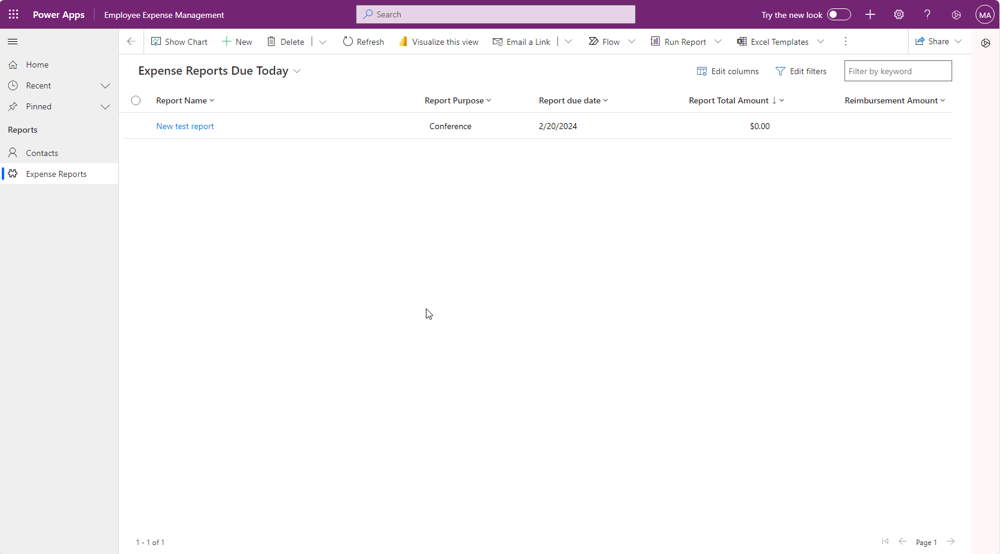

---
lab:
  title: 'Lab 3: Cara membuat aplikasi berbasis model'
  module: 'Module 3: Get started with Power Apps'
---

# Lab 3: Cara membuat aplikasi berbasis model

**Penyewa WWL - Ketentuan Penggunaan** Jika Anda diberikan penyewa sebagai bagian dari pengiriman pelatihan yang dipimpin instruktur, harap dicatat bahwa penyewa tersedia untuk tujuan mendukung lab langsung dalam pelatihan yang dipimpin instruktur. Penyewa tidak boleh dibagikan atau digunakan untuk tujuan di luar lab praktik. Penyewa yang digunakan dalam kursus ini adalah penyewa uji coba dan tidak dapat digunakan atau diakses setelah kelas berakhir dan tidak memenuhi syarat untuk ekstensi. Penyewa tidak boleh dikonversi ke langganan berbayar. Penyewa yang diperoleh sebagai bagian dari kursus ini tetap menjadi milik Microsoft Corporation dan kami berhak mendapatkan akses dan repositorinya kapan saja. 

## Skenario

Bellows College adalah organisasi pendidikan dengan beberapa gedung di kampus. Pengunjung kampus saat ini tercatat dalam jurnal kertas. Informasi tidak diambil secara konsisten, dan tidak ada sarana untuk mengumpulkan dan menganalisis data tentang kunjungan di seluruh kampus.

Administrasi kampus ingin memodernisasi sistem pendaftaran pengunjung mereka dengan akses ke gedung dikendalikan oleh personel keamanan dan semua kunjungan harus didaftarkan sebelumnya dan dicatat oleh pemandu mereka.

Sepanjang kursus ini, Anda akan membangun aplikasi dan melakukan otomatisasi untuk memungkinkan administrasi dan personel keamanan Bellows College mengelola dan mengontrol akses ke gedung-gedung di kampus.

Di lab ini, Anda akan membuat aplikasi berbasis model Power Apps untuk memungkinkan staf kampus backoffice mengelola catatan kunjungan di seluruh kampus.

## Langkah-langkah lab tingkat tinggi

Sebagai bagian dari pembuatan aplikasi berbasis model, Anda akan menyelesaikan hal berikut:

- Membuat aplikasi berbasis model baru bernama Bellows Expense Management

- Mengedit navigasi aplikasi untuk merujuk tabel yang diperlukan

- Menyesuaikan bentuk dan tampilan tabel yang diperlukan untuk aplikasi

Kami akan bekerja dengan komponen berikut:

- **Tampilan**: Tampilan memungkinkan pengguna menampilkan data yang ada dalam tabel formulir.

- **** Formulir: Di sinilah pengguna membuat/memperbarui baris baru dalam tabel.

Keduanya akan diintegrasikan ke aplikasi berbasis model untuk pengalaman pengguna yang lebih baik.

### Prasyarat

- Penyelesaian **Modul 1 Lab 0 - Memvalidasi lingkungan lab**

**Hal-hal yang perlu dipertimbangkan sebelum Anda mulai**

- Perubahan apa yang harus kami lakukan untuk meningkatkan pengalaman pengguna?

- Apa yang harus kami sertakan dalam aplikasi berbasis model berdasarkan model data yang telah kami buat?

- Penyesuaian apa yang dapat dilakukan pada peta situs aplikasi berbasis model?

## Latihan 1: Menyesuaikan Tampilan serta Formulir

**Tujuan:** Dalam latihan ini, Anda akan menyesuaikan tampilan dan formulir tabel kustom yang dibuat yang akan digunakan di aplikasi berbasis model.

### Tugas #1: Edit Formulir Laporan Pengeluaran

1. Jika Anda belum melakukannya, masuk ke https://make.powerapps.com

1. **Pilih lingkungan Dev One** di kanan atas jika belum dipilih.

1. Menggunakan navigasi di sebelah kiri, pilih **Tabel**, dan buka **tabel Laporan** Pengeluaran.

Jika Anda tidak melihat tabel Laporan pengeluaran, pastikan Anda berada di lingkungan yang benar (Langkah 2).

1. Di bawah bagian **Pengalaman data** , pilih **Formulir** dan buka **formulir Informasi** dengan **jenis Formulir Utama** . (**Penting:** Pastikan Anda memilih formulir dengan jenis **formulir Utama**.)

    >**PENTING:** Karena secara default semua formulir diberi nama Informasi, pastikan untuk memverifikasi bahwa formulir yang Anda pilih memiliki Jenis **Utama** Formulir dan bukan yang lain. Secara default, formulir memiliki dua bidang: Nama dan Pemilik.

1. Di sisi kanan layar pada panel **Properti** , pilih **bidang Nama** Tampilan, dan ubah ke Informasi Laporan

1. Pilih **Kolom tabel** dari panel navigasi kiri dan tambahkan bidang berikut ini di bawah **bidang Pemilik** dengan menyeret kolom ke formulir atau cukup mengklik nama kolom:

    - **Keterangan**

    - **Tujuan Laporan**

    - **Tanggal Jatuh Tempo Laporan**

    - **Laporkan Jumlah Total**

1. **Seret kolom Alasan** Status dan letakkan di header formulir.

Header adalah area kanan atas formulir. Anda mungkin perlu menciutkan panel Properti di sisi kanan layar untuk melihat bidang pada formulir.

1. Pilih bidang **Pemilik**. Di panel Properti, ubah Label** menjadi Pemohon **

1. Pilih tombol **Simpan dan terbitkan** di kanan atas dan tunggu hingga penyimpanan dan penerbitan selesai.

1. Jika tampilan Edit dibuka di tab atau jendela browser baru, tutup tampilan tersebut. Jika tidak, pilih **🡠 Kembali** di kiri atas layar. Anda sekarang harus kembali ke **formulir tabel Laporan** Pengeluaran.

1. Menggunakan remah roti di kiri atas (**Formulir** Laporan > ****Pengeluaran Tabel).** > ** Pilih **Laporan** Pengeluaran untuk kembali ke **layar properti Kunjungi** Tabel.

## Tugas #2: Edit tampilan Kunjungan Aktif

Dalam tugas ini, kami akan memodifikasi tampilan Laporan Pengeluaran Aktif default dan membuat tampilan baru untuk kunjungan hari ini.

1. Di bawah bagian **Pengalaman data**, pilih **Tampilan** dan buka tampilan Laporan** Pengeluaran Aktif Anda**.

1. Tambahkan bidang berikut ke tampilan dengan mengklik atau menyeret dan menjatuhkan bidang:

    - **Tujuan Laporan**

    - **Tanggal Jatuh Tempo Laporan**

    - **Total Laporan**

1. Pilih menu drop-down pada **kolom Dibuat Pada** dan pilih **Hapus**. Bidang **Dibuat Pada** sekarang akan dihapus dari tampilan.

1. Mengubah ukuran lebar kolom individual sesuai dengan data.

1. Di bawah **Urutkan menurut ...** pilih X untuk menghapus **Nama** dan sebagai gantinya, pilih **Laporkan Jumlah** Total.

1. Pilih **Laporkan Jumlah** Total untuk mengubah urutan pengurutan menjadi **Lebih Besar menjadi Lebih** Kecil.

1. Pilih tombol **Simpan dan terbitkan** di kanan atas dan tunggu penerbitan selesai.

### Tugas #3: Buat tampilan baru untuk Laporan yang jatuh tempo hari ini

Sekarang, kita akan mengkloning tampilan untuk membuat tampilan baru untuk laporan yang jatuh tempo hari ini.

>    **PENTING:** Pastikan Anda tidak menutup tampilan Laporan Pengeluaran Aktif, karena kami akan memanfaatkannya untuk membuat tampilan Laporan yang jatuh tempo hari ini.

1. Pilih **Simpan Sebagai**.

1. **Ubah Nama** menjadi Laporan Pengeluaran Jatuh Tempo Hari Ini dan pilih **Simpan**.

1. Pilih **Edit filter**, di panel Properti.

1. Pilih **+ Tambahkan**, pilih **Tambahkan baris**.

1. Pilih **Laporkan tanggal** jatuh tempo sebagai bidang, lalu ubah **Sama dengan** **Hari Ini** sebagai kondisi di menu drop-down.

1. **Pilih ...** **** Perintah lainnya pada baris Status** dan pilih **Hapus** untuk menghapus kondisi filter tersebut**.

1. Pilih **Ok** untuk menyimpan kondisi. Tampilan sekarang difilter untuk memperlihatkan hanya rekaman di mana **tanggal** jatuh tempo Laporan adalah hari ini.

1. **Tambahkan bidang Jumlah** Penggantian ke tampilan.

1. Pilih tombol **Simpan dan terbitkan** di kanan atas dan tunggu penerbitan selesai.

## Latihan 2: Membuat Aplikasi Berbasis Model

**Tujuan:** Dalam latihan ini, Anda akan membuat aplikasi berbasis model, menyesuaikan peta situs, serta menguji aplikasi.

Demi kesederhanaan dan waktu, kami tidak akan membahas semua kolom Laporan Pengeluaran di lab ini.

### Tugas #1: Membuat aplikasi

1. Jika Anda belum melakukannya, masuk ke https://make.powerapps.com

1. **Pilih lingkungan Dev One** di kanan atas, jika belum dipilih.

1. Pilih **+ Buat** di navigasi kiri.

1. Buat Aplikasi Berbasis Model:

    - Pilih **Aplikasi** kosong di bagian ****Mulai dari** layar Buat aplikasi** Anda.

    - Di bagian **Aplikasi kosong berdasarkan Dataverse**, pilih **Buat**.

    - Masukkan Manajemen Pengeluaran Karyawan untuk **Nama** dan pilih **Buat**.

1. Setelah aplikasi berbasis model baru Anda dimuat, pilih tombol **+ Tambahkan Halaman**.

1. **Pada layar Tambahkan Halaman**, pilih **Tabel** dataverse, lalu pilih tombol **Berikutnya**.

1. Pilih tabel berikut:

    - Laporan Pengeluaran

    - Kontak

1. Setelah Anda memiliki kedua tabel, pilih **Tambahkan**.

1. Menggunakan ikon navigasi di sisi kiri layar, pilih **Navigasi**.

1. Pada Panel Navigasi, pilih **Grup** Baru di bawah ini di mana tertulis Navigasi. Anda mungkin perlu memperluas menu di sebelah kiri.

1. Di sisi kanan layar, di bagian **Opsi** tampilan, ubah **properti Judul** menjadi Laporan

1. Klik **Simpan** dan tunggu hingga perubahan disimpan.

1. Setelah **Simpan** selesai, pilih tombol **Terbitkan** untuk menerbitkan perubahan Anda. Tunggu hingga penerbitan selesai.

## Tugas #2: Uji aplikasi

**Memulai aplikasi**

1. Pilih tombol **Putar** , aplikasi berbasis model akan dimuat di tab baru.

**Buat Kontak baru**

1. Aplikasi akan terbuka pada tampilan **Kontak Aktif Saya**. Jika tidak, pilih **Kontak** di navigasi kiri.

1. Pilih **+ Baru** dari bilah perintah.

1. Masukkan **Nama** Depan sebagai John dan **Nama** Belakang sebagai Doe

1. Berikan email pribadi Anda sebagai **Email**. Ini akan digunakan di lab mendatang, di mana Anda akan menerima email.

1. Pilih **Simpan &amp; Tutup**.

1. Anda kini akan melihat kontak yang dibuat pada tampilan **Kontak Aktif Saya**.

**Membuat Laporan Pengeluaran baru**

1. Pilih **Laporan** Pengeluaran dari navigasi sebelah kiri (Juga dikenal sebagai peta situs.)

1. Pilih **+ Baru**.

1. Masukkan bidang sebagai berikut:

    - **Nama** Laporan: Laporan pengujian baru

    - **Tujuan** Laporan: pilih **Konferensi**

    - **Tanggal jatuh tempo laporan**: Pilih Tanggal hari ini

1. Pilih **Simpan &amp; Tutup**. Ini akan membuat Kunjungan dan Anda harus dapat melihatnya pada **tampilan Kunjungan** Aktif.

1. Ubah tampilan ke **Laporan Pengeluaran Jatuh Tempo Hari Ini** dengan menggunakan menu drop-down di samping **Kunjungan** Aktif. 

1. Anda dapat menambahkan beberapa catatan pengujian lainnya.

Aplikasi berbasis model anda yang sedang berjalan akan terlihat seperti berikut ini:

Selamat! Anda telah membuat dan mengonfigurasi aplikasi berbasis model pertama Anda.
