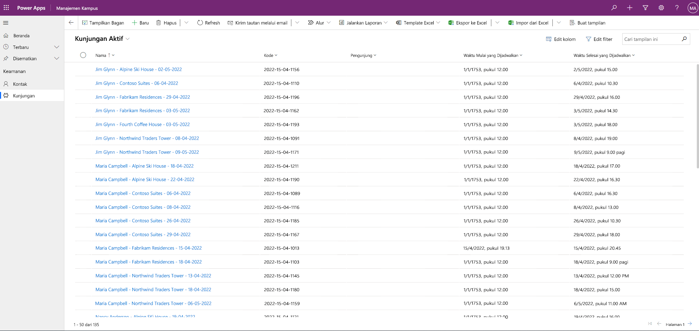

---
lab:
  title: 'Lab 3: Cara membuat aplikasi berbasis model'
  module: 'Module 3: Get started with Power Apps'
ms.openlocfilehash: ed98e1f2c2ff900f84b98910e0ef2d14d130f462
ms.sourcegitcommit: dbffa13e13419f5b9aadc894eb95fd16215b2ebf
ms.translationtype: HT
ms.contentlocale: id-ID
ms.lasthandoff: 06/17/2022
ms.locfileid: "146458374"
---
# Modul 3: Mulai dengan Power Apps
## Lab: Cara membuat aplikasi berbasis model

# Skenario

Bellows College adalah organisasi pendidikan dengan beberapa gedung di kampus. Pengunjung kampus saat ini tercatat dalam jurnal kertas. Informasi tidak diambil secara konsisten, dan tidak ada sarana untuk mengumpulkan dan menganalisis data tentang kunjungan di seluruh kampus.

Administrasi kampus ingin memodernisasi sistem pendaftaran pengunjung mereka dengan akses ke gedung dikendalikan oleh personel keamanan dan semua kunjungan harus didaftarkan sebelumnya dan dicatat oleh pemandu mereka.

Sepanjang kursus ini, Anda akan membangun aplikasi dan melakukan otomatisasi untuk memungkinkan administrasi dan personel keamanan Bellows College mengelola dan mengontrol akses ke gedung-gedung di kampus.

Di lab ini, Anda akan membuat aplikasi berbasis model Power Apps untuk memungkinkan staf kampus backoffice mengelola catatan kunjungan di seluruh kampus.

Langkah-langkah lab tingkat tinggi

Sebagai bagian dari pembuatan aplikasi berbasis model, Anda akan menyelesaikan hal berikut:

- Membuat aplikasi berbasis model baru bernama Manajemen Kampus

- Mengedit navigasi aplikasi untuk merujuk tabel yang diperlukan

- Menyesuaikan bentuk dan tampilan tabel yang diperlukan untuk aplikasi

Kami akan bekerja dengan komponen berikut:

- **Tampilan**: Tampilan memungkinkan pengguna menampilkan data yang ada dalam tabel formulir.

- **Formulir**: Di sinilah pengguna membuat/memperbarui baris baru dalam tabel.

Keduanya akan diintegrasikan ke aplikasi berbasis model untuk pengalaman pengguna yang lebih baik.

Prasyarat

- Penyelesaian **Modul 0 Lab - Memvalidasi lingkungan lab**

- Penyelesaian **Modul 2 Lab - Pemodelan data**

- Penyelesaian **Modul 3 Lab - Cara membuat aplikasi kanvas**

Hal-hal yang perlu dipertimbangkan sebelum memulai

- Perubahan apa yang harus kami lakukan untuk meningkatkan pengalaman pengguna?

- Apa yang harus kami sertakan dalam aplikasi berbasis model berdasarkan model data yang telah kami buat?

- Penyesuaian apa yang dapat dilakukan pada peta situs aplikasi berbasis model?

Latihan #1: Menyesuaikan Tampilan dan Formulir

**Tujuan:** Dalam latihan ini, Anda akan menyesuaikan tampilan dan bentuk tabel yang dibuat khusus yang akan digunakan dalam aplikasi berbasis model.

Tugas 1: Mengedit Formulir Kunjungan

1. Masuk ke [https://make.powerapps.com](https://make.powerapps.com/) jika Anda belum masuk.

2. Pilih lingkungan **Latihan [inisial saya]** Anda di kanan atas jika belum dipilih.

3. Di menu navigasi sebelah kiri, luaskan **Dataverse**, pilih **Tabel**, dan klik untuk membuka tabel **Kunjungan** Anda.

Jika Anda tidak melihat tabel Kunjungi, pastikan Anda berada di lingkungan yang benar (langkah 2).

4. Pada bagian Pengalaman Data, pilih **Formulir** dan klik untuk membuka formulir Informasi dengan jenis formulir **Utama**.

**PENTING:** Karena secara default semua formulir diberi nama Informasi, pastikan untuk memverifikasi bahwa formulir yang Anda pilih memiliki Jenis Formulir **Utama** dan bukan yang lain. Secara default, formulir memiliki dua bidang: Nama (Bidang Utama) dan Pemilik.

5. Di sisi kanan layar di panel Properti, pilih bidang **Nama Tampilan**, dan ubah ke **Informasi Utama**.

6. Di menu bagian atas layar, pilih **+ Bidang formulir** dan tambahkan bidang berikut di bawah bidang **Pemilik** dengan menyeret kolom ke formulir atau cukup mengklik nama kolom:

    0. **Pengunjung**

    1. **Waktu Mulai yang Dijadwalkan**

    2. **Waktu Selesai yang Dijadwalkan**

    3. **Mulai Aktual**

    4. **Akhir Aktual**

7. Seret kolom **Kode** dan letakkan di header formulir.

Header adalah area kanan atas formulir. Anda mungkin perlu menciutkan panel Properti di sisi kanan layar untuk melihat bidang pada formulir.

8. Dengan bidang **Kode** masih dipilih, centang kotak **Baca-saja** di panel Properti di sisi kanan layar.

9. Pilih bidang **Pemilik**. Di panel Properti, ubah **Label** menjadi **Host**

10. Klik **Simpan** di kanan atas dan tunggu hingga penyimpanan selesai.

11. Klik **Terbitkan** di kanan atas dan tunggu hingga penerbitan selesai.

12. Jika tampilan edit dibuka di tab atau jendela browser baru, tutup tampilan tersebut. Jika tidak, klik **Kembali** di kiri atas layar. Anda sekarang harus kembali ke Tab Formulir tabel Kunjungan.

13. Menggunakan petunjuk navigasi di kiri atas (Tabel>Kunjungan>Formulir). Pilih **Kunjungan** untuk kembali ke layar utama tabel **Kunjungan**. 

Tugas #2: Edit tampilan Kunjungan Aktif

Dalam tugas ini, kita akan mengubah tampilan Kunjungan Aktif default dan membuat tampilan baru untuk kunjungan hari ini.

1. Pada bagian Pengalaman data, pilih **Tampilan** dan klik untuk membuka tampilan **Kunjungan Aktif** Anda.

2. Tambahkan bidang berikut ke tampilan dengan mengklik atau menyeret dan menjatuhkan bidang:

    0. **Kode**

    1. **Pengunjung**

    2. **Waktu Mulai yang Dijadwalkan**

    3. **Waktu Selesai yang Dijadwalkan**

3. Klik kolom **Dibuat Pada** dan pilih **Hapus**. Bidang **Dibuat Pada** sekarang akan dihapus dari tampilan.

4. Ubah ukuran lebar kolom masing-masing agar sesuai dengan data.

5. Klik **Simpan** dan tunggu hingga perubahan disimpan.

6. Klik **Terbitkan** dan tunggu hingga penerbitan selesai.

Tugas #3: Membuat tampilan baru untuk kunjungan hari ini

Sekarang, kita akan mengkloning tampilan untuk membuat tampilan baru untuk kunjungan hari ini.

PENTING: Pastikan Anda tidak menutup tampilan Kunjungan Aktif, karena kita akan memanfaatkannya untuk membuat tampilan kunjungan hari ini yang baru. 

1. Klik **panah dropdown** di sebelah tombol Simpan (hati-hati jangan sampai tidak sengaja menekan tombol itu) dan pilih **Simpan Sebagai**.

2. Ubah nama menjadi **Kunjungan Hari Ini** dan tekan **Simpan**.

3. Klik tautan **Edit filter** di panel Properti.

4. Klik **Tambahkan**, pilih **Tambahkan baris**.

5. Pilih **Waktu Mulai yang Dijadwalkan** sebagai bidang, lalu pilih **Hari ini** sebagai ketentuan di dropdown.

6. Klik **…** pada baris **Status** dan klik **Hapus** untuk menghapus kondisi filter tersebut.

7. Tekan **Oke** untuk menyimpan kondisi. Tampilan sekarang difilter untuk menampilkan hanya catatan dengan tanggal Mulai Terjadwal adalah hari ini.

8. Tambahkan bidang **Waktu Mulai Aktual** dan **Waktu Selesai Aktual** ke tampilan.

**Catatan:** Karena kita tidak lagi memfilter status tampilan, kita akan mendapatkan semua kunjungan hari ini termasuk kunjungan yang telah selesai. Kolom ini akan membantu membedakan kunjungan yang telah selesai dan kunjungan yang sedang berlangsung.

1. Klik **Simpan**.

2. Klik **Terbitkan** dan tunggu hingga penerbitan selesai.

Latihan #2: Membuat Aplikasi Berbasis Model

**Tujuan:** Dalam latihan ini, Anda akan membuat aplikasi berbasis model, menyesuaikan peta situs, dan menguji aplikasi.

Demi kesederhanaan dan waktu, kita tidak akan membahas beberapa kolom Kunjungan di lab ini.

Tugas 1: Membuat Aplikasi

1. Masuk ke [https://make.powerapps.com](https://make.powerapps.com/) (jika Anda belum masuk).

2. Pilih lingkungan **Latihan [inisial saya]** Anda di kanan atas jika belum dipilih.

3. Buat Aplikasi Berbasis Model:

    0. Pilih **Aplikasi kosong** di bagian **Mulai dari** layar Beranda.

    1. Di bagian **Aplikasi kosong berdasarkan Dataverse**, pilih **Buat**.

    2. Masukkan **Manajemen Kampus Bellows** untuk Nama dan pilih **Buat**.

4. Setelah aplikasi berbasis model baru Anda dimuat, pilih tombol **+ Tambahkan Halaman**.

5. Pada layar Tambahkan Halaman, pilih **Tampilan dan formulir berbasis tabel**, lalu pilih tombol **Berikutnya**.

6. Tambahkan tabel berikut:

    0. Kunjungan

    1. Kontak

7. Setelah memilih 2 tabel, pilih **Tambahkan**.

8. Menggunakan ikon navigasi di sisi kiri layar, pilih **Navigasi**.

9. Di Panel Navigasi, pilih **Grup 1** di bawah teks bertuliskan bilah Navigasi.

10. Di sisi kanan layar, di bagian **Opsi Tampilan**, ubah properti **Judul** menjadi **Keamanan**.

Tugas #2: Mengedit aplikasi Anda

Setelah memiliki semua komponen yang diperlukan yang ditambahkan ke aplikasi berbasis model Anda, sekarang kami akan mengatur item.

1. Di Panel Navigasi, di bawah grup keamanan, pilih **SubArea1**.

2. Pilih **Ellipsis**, dan dari menu yang muncul, pilih hapus **SubArea1**.

3. Di menu navigasi sebelah kiri, pilih **Halaman**.

4. Temukan dan perluas **Kunjungi** di panel Halaman.

5. Pilih **Formulir kunjungan**.

6. Di sisi kanan layar, pilih **Tambahkan formulir**.

7. Pilih formulir **Informasi Utama**.

8. Di bagian **Kunjungi** di panel Halaman, pilih **Buka tampilan**.

9. Di sisi kanan layar, pilih **Tambahkan tampilan**.

10. Pilih tampilan **Kunjungan Hari Ini**.

11. Pilih **Tambahkan tampilan** lagi. 

12. Pilih tampilan **Kunjungan Aktif**. 

13. Pilih **Simpan**.

14. Setelah **Simpan** selesai, pilih tombol **Terbitkan** untuk menerbitkan perubahan Anda.

Tugas #3: Menguji Aplikasi

1. Mulai aplikasi

    0. Pilih **Putar** untuk membuka aplikasi Anda di jendela baru.

2. Membuat Kontak baru

    0. Aplikasi akan terbuka pada tampilan **Kontak Aktif Saya**. Jika tidak, pilih Kunjungan di sebelah kiri.

    1. Klik **Baru** dari menu atas.

    2. Berikan **Nama Depan** sebagai John dan **Nama Belakang** sebagai Doe.

    3. Berikan email pribadi Anda sebagai **Email**. Ini akan digunakan di lab mendatang di mana Anda akan menerima email.

    4. Klik **Simpan dan Tutup**.

    5. Anda sekarang akan melihat kontak yang dibuat pada tampilan **Kontak Aktif**.

3. Membuat Kunjungan baru

    0. Pilih **Kunjungan** dari peta situs.

    1. Klik **Baru**.

    2. Masukkan bidang sebagai berikut

        0. **Nama**: Kunjungan pengujian baru

        1. **Pengunjung**: pilih John Doe

        2. **Waktu Mulai yang Dijadwalkan**: pilih tanggal besok dan pukul 14.00 sebagai waktu mulai

        3. **Waktu Selesai yang Dijadwalkan**: pilih tanggal besok dan pukul 15.30 sebagai waktu selesai

- Klik **Simpan dan Tutup**. Ini akan membuat Kunjungan dan Anda akan dapat melihatnya di Tampilan Kunjungan Aktif.

- Ubah tampilan menjadi **Kunjungan Hari Ini**. Anda sekarang tidak akan melihat kunjungan baru lagi dalam tampilan, karena dijadwalkan untuk besok.

4. Anda dapat menambahkan lebih banyak catatan pengujian.

Aplikasi Anda yang sedang berjalan akan terlihat kira-kira seperti berikut:

Selamat! Anda telah membuat dan mengonfigurasi aplikasi berbasis model pertama Anda.

# Tantangan

-   Pilih tampilan dan formulir tertentu untuk Kontak
