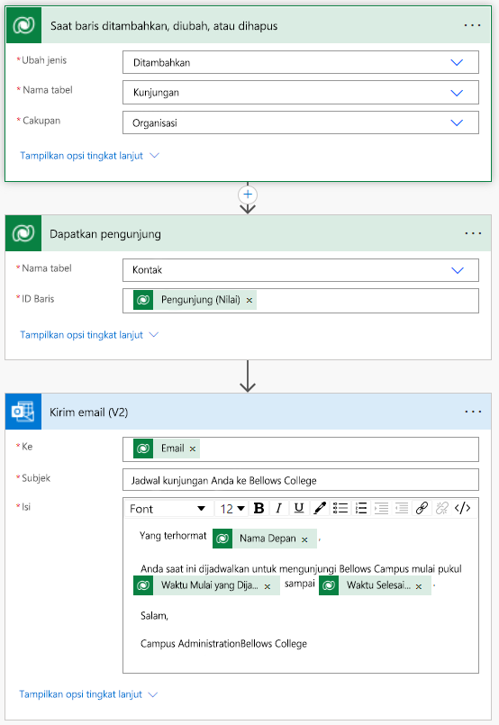

---
lab:
  title: 'Lab 4: Cara membangun solusi otomatis'
  module: 'Module 4: Get Started with Power Automate'
---

# Lab 4: Cara membangun solusi otomatis

## Skenario

Bellows College is an educational organization with multiple buildings on campus. Campus visitors are currently recorded in paper journals. The information is not captured consistently, and there are no means to collect and analyze data about the visits across the entire campus.

Administrasi kampus ingin memodernisasi sistem pendaftaran pengunjung mereka dengan akses ke gedung dikendalikan oleh personel keamanan dan semua kunjungan harus didaftarkan sebelumnya dan dicatat oleh pemandu mereka.

Sepanjang kursus ini, Anda akan membangun aplikasi dan melakukan otomatisasi untuk memungkinkan administrasi dan personel keamanan Bellows College mengelola dan mengontrol akses ke gedung-gedung di kampus.

Di lab ini, Anda akan membuat alur Power Automate untuk mengirim email kepada pengunjung saat kunjungan dijadwalkan.

## Langkah-langkah lab tingkat tinggi

Berikut ini telah diidentifikasi sebagai persyaratan yang harus Anda terapkan untuk menyelesaikan proyek:

- Kontak perlu diberi tahu melalui email saat kunjungan dijadwalkan.

## Prasyarat

- Penyelesaian **Modul 0 Lab 0 - Memvalidasi lingkungan lab**
- Menyelesaikan **Modul 2 Lab 1 - Membuat Model Data**
- Penyelesaian **Modul 2 Lab 3 - Cara membuat aplikasi berbasis model**
- Kontak John Doe dibuat dengan alamat email pribadi yang diisi

## Latihan 1: Membuat alur Pemberitahuan Kunjungan

<bpt id="p1">**</bpt>Objective:<ept id="p1">**</ept> In this exercise, you will create a Power Automate flow that implements the requirement. The visitor should be sent an email that includes the unique code assigned to the visit when a visit is created.

### Tugas \#1: Buat alur

1.  Navigate to <ph id="ph1">&lt;https://make.powerapps.com&gt;</ph>. You may need to reauthenticate - click <bpt id="p1">**</bpt>Sign in<ept id="p1">**</ept> and follow instructions if needed.

2.  Pilih lingkungan **Latihan [inisial saya]** Anda di kanan atas jika belum dipilih.

3.  Di menu navigasi kiri, pilih **Alur**.

4.  Jika diminta, pilih **Mulai**.

5.  Klik **Alur baru** dan pilih **Alur cloud otomatis**.

6.  Masukkan "Kunjungi Pemberitahuan" untuk **nama Flow**.

7.  Di **Pilih pemicu alur Anda**, cari **Dataverse**.

8.  Pilih pemicu **Bila baris ditambahkan, diubah, atau dihapus**, lalu klik **Buat**.

9.  Isi kondisi pemicu untuk alur:

    1.  Pilih **Ditambahkan** untuk **Ubah jenis**

    2.  Pilih **Kunjungan** untuk **Nama tabel**

    3.  Pilih **Organisasi** untuk **Cakupan**

    4.  On the trigger step, click the ellipsis (<bpt id="p1">**</bpt>...<ept id="p1">**</ept>) and click <bpt id="p2">**</bpt>Rename<ept id="p2">**</ept>. Rename this trigger <bpt id="p1">**</bpt>"When a visit is added"<ept id="p1">**</ept>. This is a good practice, so you and other flow editors can understand the purpose of the step without having to dive into the details.

### Tugas \#2: Membuat langkah untuk mendapatkan baris pengunjung

1.  Bellows College adalah organisasi pendidikan dengan beberapa gedung di kampus.

2.  Cari **Dataverse**.

3.  Pilih tindakan **Dapatkan baris berdasarkan ID**.

4.  Pilih **Kontak** sebagai **Nama tabel**

5.  Pengunjung kampus saat ini tercatat dalam jurnal kertas.

6.  Informasi tidak diambil secara konsisten, dan tidak ada sarana untuk mengumpulkan dan menganalisis data tentang kunjungan di seluruh kampus.

7.  On this action, click the ellipsis (<bpt id="p1">**</bpt>...<ept id="p1">**</ept>) and click <bpt id="p2">**</bpt>Rename<ept id="p2">**</ept>.
        Rename this action <bpt id="p1">**</bpt>"Get the Visitor"<ept id="p1">**</ept>. This is a good practice, so you and other flow editors can understand the purpose of the step without having to dive into the details.

### Tugas \#3: Membuat langkah untuk mengirim email ke pengunjung

1.  Click <bpt id="p1">**</bpt>+ New step<ept id="p1">**</ept>. This is the step that will send an email to the visitor.

2.  Cari *email*, pilih konektor **Office 365 Outlook** dan tindakan **Kirim email (V2)** .

3.  Jika diminta untuk Menerima persyaratan dan ketentuan untuk menggunakan tindakan ini, klik **Terima**.

4.  Pilih **Tambahkan konten dinamis** di bagian bidang **Kepada**. 
    
5.  Pilih **Email** dari daftar konten Dinamis.
        > Notice that it is beneath the **Get the visitor** header. This means you
        are selecting the Email that is related to the Visitor that you looked
        up in the previous step.

6.  Masukkan **Kunjungan terjadwal Anda ke Bellows College** di bidang **Subjek**.

7.  Masukkan teks berikut di **Isi Email**:

>   Dynamic content needs to be placed where fields are named in brackets. It is recommended to copy &amp; paste all text first and then add dynamic content in the correct places.

~~~~~~~~~~~~~~~~~~~~~~~~~~~~~~~~~~~~~~~~~~~~~~~~~~~~~~~~~~~~~~~~~~~~~~~~~~~~~~~~
   Dear {First Name},

   You are currently scheduled to visit Bellows Campus from {Scheduled Start} until {Scheduled End}.

   Best regards,

   Campus Administration
   Bellows College
~~~~~~~~~~~~~~~~~~~~~~~~~~~~~~~~~~~~~~~~~~~~~~~~~~~~~~~~~~~~~~~~~~~~~~~~~~~~~~~~

8.  Highlight the <bpt id="p1">**</bpt>{First Name}<ept id="p1">**</ept> text. Replace it with the <bpt id="p1">**</bpt>First Name<ept id="p1">**</ept> field from the <bpt id="p2">**</bpt>Get the Visitor<ept id="p2">**</ept> step.

9.  Highlight the <bpt id="p1">**</bpt>{Scheduled Start}<ept id="p1">**</ept> text. Replace it with the <bpt id="p1">**</bpt>Scheduled Start<ept id="p1">**</ept> field <bpt id="p2">**</bpt>When a visit is added<ept id="p2">**</ept> step.

10.  Highlight the <bpt id="p1">**</bpt>{Scheduled End}<ept id="p1">**</ept> text. Replace it with the <bpt id="p1">**</bpt>Scheduled End<ept id="p1">**</ept> field from the <bpt id="p2">**</bpt>When a visit is added<ept id="p2">**</ept> step.

11.  Klik **Simpan**.

Leave this flow tab open for the next task. You flow should look approximately like the following:

### Tugas \#4: Memvalidasi dan menguji alurnya

1.  Buka tab baru di browser Anda dan navigasikan ke <https://make.powerapps.com>.

2.  Pilih lingkungan **Latihan [inisial saya]** Anda di kanan atas jika belum dipilih.

3.  Klik **Aplikasi** dan pilih aplikasi berbasis model, **Bellows Campus Management**, yang Anda buat sebelumnya.

3.  Dengan membiarkan tab browser ini terbuka, navigasikan kembali ke tab sebelumnya dengan alur Anda.

4.  On the command bar, click <bpt id="p1">**</bpt>Test<ept id="p1">**</ept>. Select <bpt id="p1">**</bpt>Manually<ept id="p1">**</ept> and then click <bpt id="p2">**</bpt>Test<ept id="p2">**</ept>.

5.  Navigasikan ke tab browser dengan aplikasi berbasis model Anda terbuka. 

6.  Di menu navigasi sebelah kiri, pilih **Kunjungan**

6. Tekan tombol **+ Baru** untuk menambahkan data **Kunjungan** baru.

7. Lengkapi catatan Kunjungan sebagai berikut:

    -   **Nama:** Kunjungan Pengujian

    -   **Pengunjung:** John Doe

    -   **Jadwal Mulai:** Besok pukul 08.00

    -   **Jadwal Selesai:** Besok pukul 09.00

8. Pilih tombol **Simpan dan Tutup**.

9. Navigate to the browser tab with your flow test running. After a short delay, you should see the flow running. This is where you can catch any issues in the flow or confirm that it ran successfully.

After a short delay, you should see an email in your inbox, since you populated John Doe's email as your personal email. Note that it may go to your Junk Email folder.

## Tantangan

- Play around with the formatting on the email. How can you make it more professional looking?